Plot the eyetracking data
================
Tristan Mahr
2017-11-07

-   [Set up](#set-up)
-   [Visualize differences in standardized test results](#visualize-differences-in-standardized-test-results)
-   [Visualize the eyetracking data](#visualize-the-eyetracking-data)
    -   [Downsample into 50ms bins](#downsample-into-50ms-bins)
    -   [Look at overall looks to familiar image](#look-at-overall-looks-to-familiar-image)
    -   [Get descriptives for slide](#get-descriptives-for-slide)
    -   [Save the model-ready data](#save-the-model-ready-data)

This script prepares all the various plots we considered using for our presentation. It also saves the final datasets used for the growth curve models.

Set up
------

``` r
library(dplyr)
library(littlelisteners)
library(ggplot2)
source("./plotting-helpers.R", encoding = "UTF8")
looks <- readr::read_csv("./data/screened.csv.gz") %>% 
  mutate(
    Cond_Lab = Condition %>% 
      factor(c("real", "MP", "nonsense"),
             c("Real word", "Mispronunciation", "Nonword")))

scores <- readr::read_csv("./data/scores.csv")
```

Visualize differences in standardized test results
--------------------------------------------------

First, confirm that the groups are age-matched. Each step on the *x*-axis is a pair of children matched by age, sex, and maternal education.

``` r
ggplot(scores) +
  aes(x = resequence(Matching_PairNumber), y = EVT_Age, color = Group_Lab) +
  geom_smooth(method = "lm", formula = y ~ 1, fullrange = TRUE, na.rm = TRUE) +
  # Dodge a bit to avoid drawing points top of each other
  geom_point(na.rm = TRUE, position = position_dodge(.5)) + 
  scale_x_continuous_index() +
  legend_top() + 
  xlab("Pairs matched on age, sex and maternal ed.") +
  ylab("Age (months)") + 
  labs(caption = plot_text$group_intercept_smooth,
       color = "Group")
```

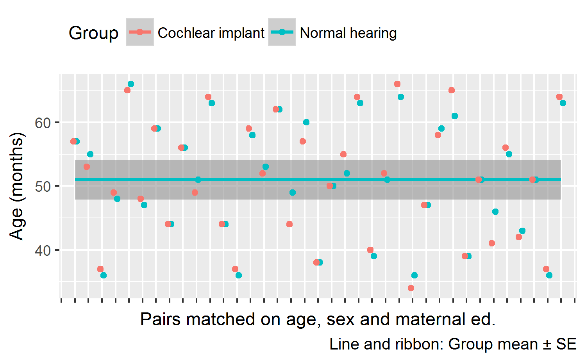

Now, do the same for the standardized test scores. These plots show how the children systematically differ in vocabulary size and articulation.

``` r
ggplot(scores) +
  aes(x = resequence(Matching_PairNumber), y = EVT_Standard, 
      color = Group_Lab) +
  geom_smooth(method = "lm", formula = y ~ 1, 
              fullrange = TRUE, na.rm = TRUE) +
  geom_point(na.rm = TRUE) + 
  scale_x_continuous_index() +
  legend_top() + 
  align_axis_right() +
  labs(
    x = plot_text$x_match_pairs,
    y = "EVT-2 standard score",
    caption = plot_text$group_intercept_smooth,
    color = "Group")
```

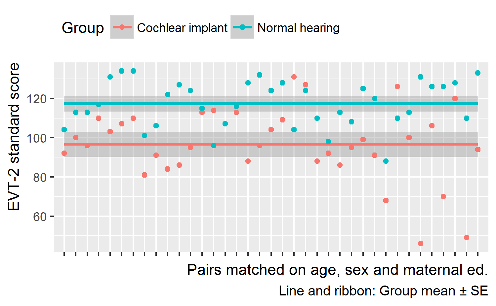

``` r

last_plot() + 
  aes(y = EVT_GSV) + 
  ylab("EVT-2 growth scale value")
```

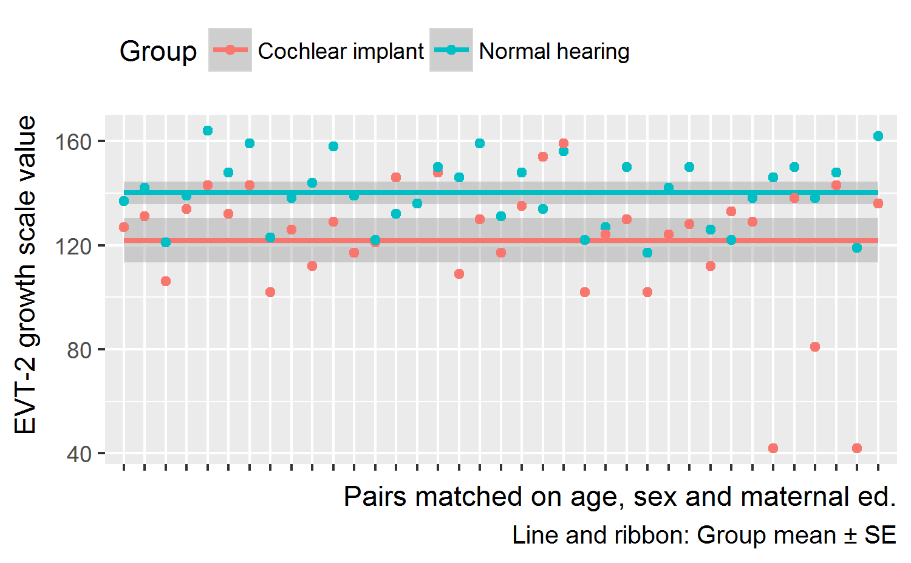

``` r

last_plot() + 
  aes(y = PPVT_Standard) + 
  ylab("PPVT-4 standard score")
```

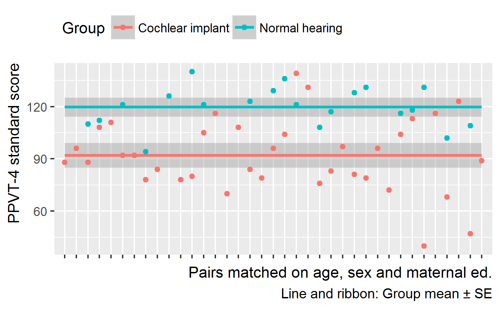

``` r

last_plot() + 
  aes(y = GFTA_Standard) + 
  ylab("GFTA-2 standard score")
```

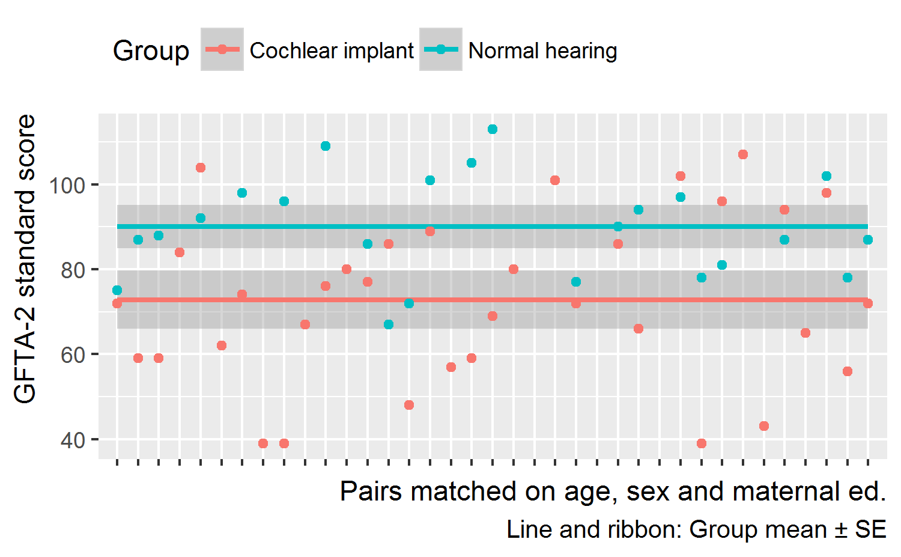

``` r

last_plot() + 
  aes(y = EVT_Age) + 
  ylab("Age (months)")
```

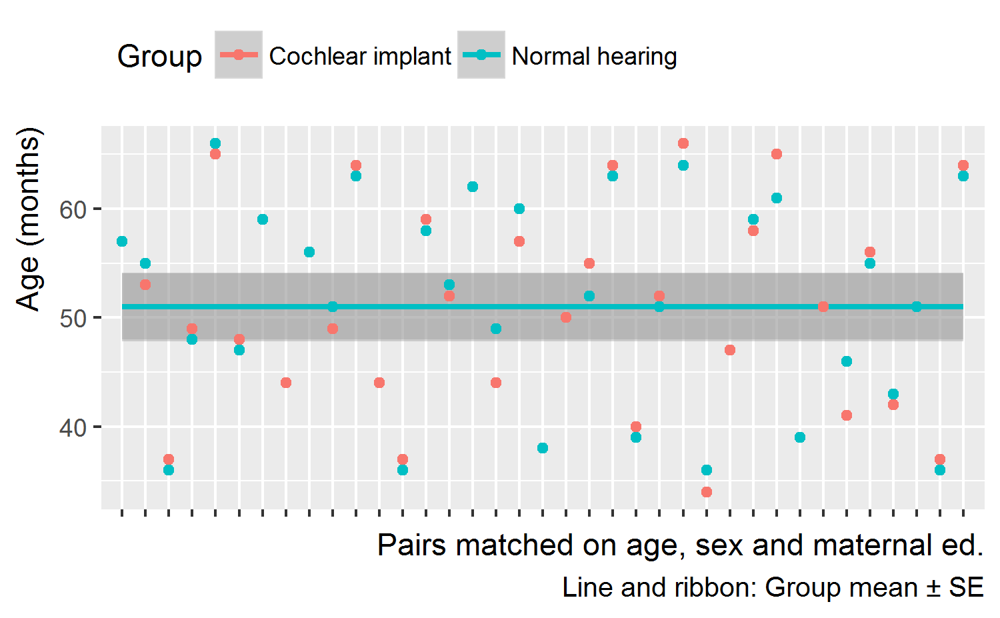

Visualize the eyetracking data
------------------------------

### Downsample into 50ms bins

``` r
times <- looks %>% 
  distinct(Time) %>% 
  arrange(Time) %>% 
  trim_to_bin_width(bin_width = 3, key_time = 0, key_position = 2, Time,
                    min_time = -900) %>% 
  assign_bins(bin_width = 3, Time, bin_col = "Bin") %>% 
  group_by(Bin) %>% 
  mutate(BinTime = median(Time) %>% round(-1))

looks <- looks %>% 
  inner_join(times)
```

### Look at overall looks to familiar image

In order to aggregate looks with my littlelisteners package, we need to define a response coding definition so it knows what's a target, what's offscreen, etc.

``` r
def <- create_response_def(
  label = "LWL scheme",
  primary = "Target",
  others = "Distractor",
  elsewhere = "tracked", 
  missing = NA)
```

We observe that the groups differ on average in the real word and nonword conditions.

``` r
look_labs <- looks %>% 
  select(Group, Condition, ends_with("_Lab")) %>% 
  distinct()

binned <- looks %>% 
  aggregate_looks(def, Group + Study + ResearchID + 
                    Condition + BinTime ~ GazeByImageAOI) %>% 
  rename(Time = BinTime) %>% 
  left_join(look_labs)

ggplot(binned) + 
  aes(x = Time, y = Prop, color = Group_Lab) + 
  hline_chance() +
  vline_onset() +
  stat_mean_se() + 
  facet_wrap("Cond_Lab", ncol = 1, scales = "free_x") + 
  labs(
    x = plot_text$x_time, 
    y = plot_text$y_target, 
    caption = plot_text$caption_mean_se,
    color = plot_text$group) + 
  legend_top()
```

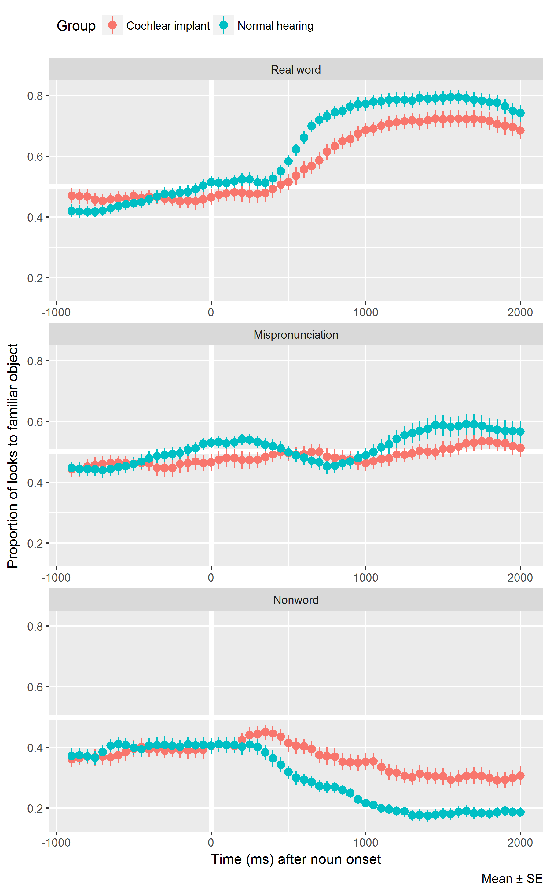

``` r
after_onset <- binned %>% filter(0 <= Time) 

after_onset %>% 
  filter(Group == "NormalHearing") %>% 
  ggplot() + 
    theme_grey(base_size = 12) + 
    aes(x = Time, y = Prop, color = Cond_Lab, shape = Group_Lab) + 
    hline_chance() +
    vline_onset() +
    stat_mean_se(data = after_onset, alpha = 0) + 
    stat_mean_se(data = . %>% filter(Condition == "real")) + 
    viridis::scale_color_viridis(end = .8, discrete = TRUE) + 
    labs(
      x = plot_text$x_time, 
      y = plot_text$y_target, 
      caption = plot_text$caption_mean_se,
      color = "Child hears",
      shape = "Group") + 
    legend_top() + 
    align_axis_right() + 
    expand_limits(x = c(.1, .9))
```

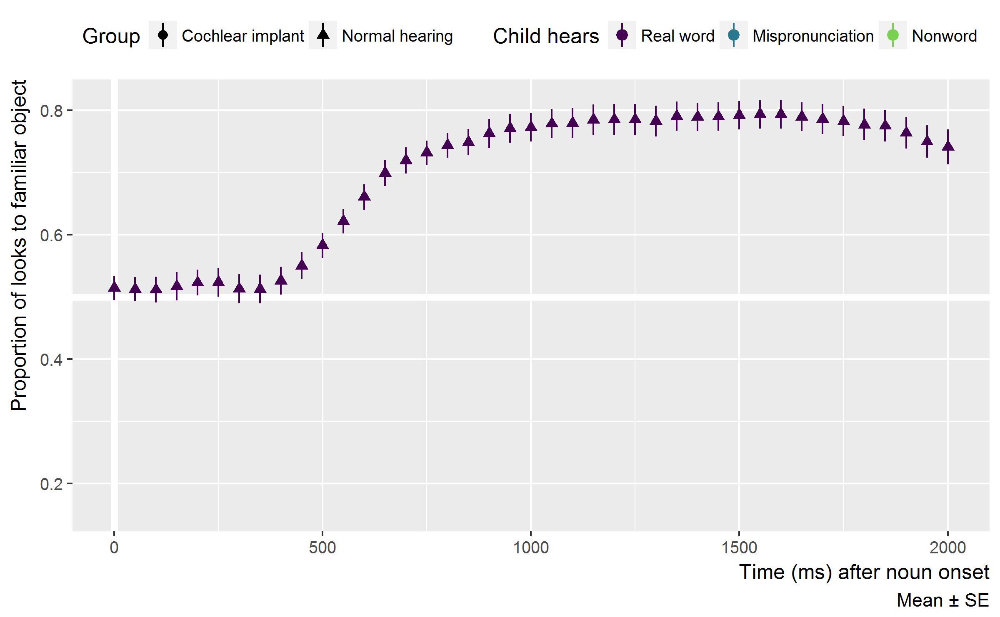

``` r

after_onset %>% 
  ggplot() + 
    theme_grey(base_size = 12) + 
    aes(x = Time, y = Prop, color = Cond_Lab, shape = Group_Lab) + 
    hline_chance() +
    vline_onset() +
    stat_mean_se(data = after_onset, alpha = 0) + 
    stat_mean_se(data = . %>% filter(Condition == "real")) + 
    viridis::scale_color_viridis(end = .8, discrete = TRUE) + 
    labs(
      x = plot_text$x_time, 
      y = plot_text$y_target, 
      caption = plot_text$caption_mean_se,
      color = "Child hears",
      shape = "Group") + 
    legend_top() + 
    align_axis_right() + 
    expand_limits(x = c(.1, .9))
```

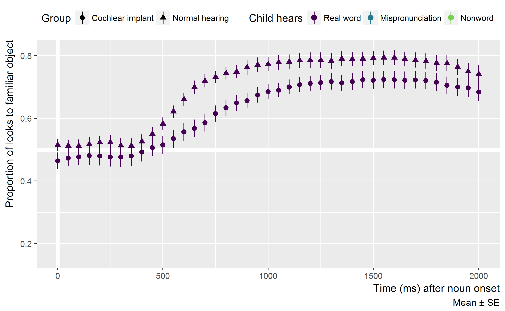

``` r

after_onset %>% 
  ggplot() + 
    theme_grey(base_size = 12) + 
    aes(x = Time, y = Prop, color = Cond_Lab, shape = Group_Lab) + 
    hline_chance() +
    vline_onset() +
    stat_mean_se(data = after_onset, alpha = 0) + 
    stat_mean_se(data = . %>% 
                   filter(Condition %in% c("real", "nonsense")) %>% 
                   filter(Group == "NormalHearing")) + 
    stat_mean_se(data = . %>% filter(Condition %in% c("real"))) + 
    viridis::scale_color_viridis(end = .8, discrete = TRUE) + 
    labs(
      x = plot_text$x_time, 
      y = plot_text$y_target, 
      caption = plot_text$caption_mean_se,
      color = "Child hears",
      shape = "Group") + 
    legend_top() + 
    align_axis_right() + 
    expand_limits(x = c(.1, .9))
```

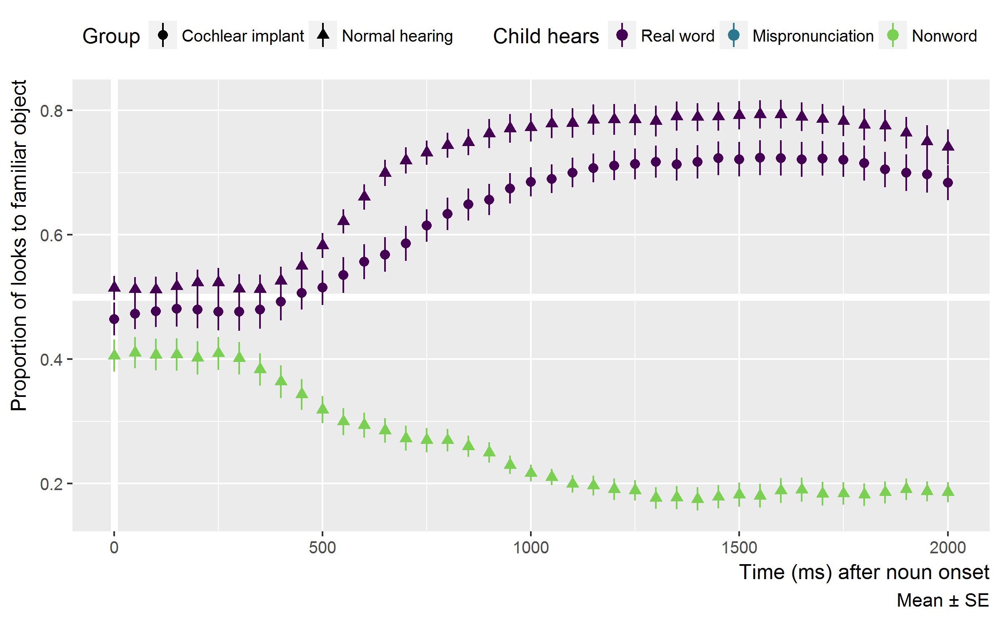

``` r

after_onset %>% 
  ggplot() + 
    theme_grey(base_size = 12) + 
    aes(x = Time, y = Prop, color = Cond_Lab, shape = Group_Lab) + 
    hline_chance() +
    vline_onset() +
    stat_mean_se(data = after_onset, alpha = 0) + 
    stat_mean_se(data = . %>% 
                   filter(Condition %in% c("real", "nonsense")) %>% 
                   filter(Group == "NormalHearing")) + 
    stat_mean_se(data = . %>% filter(Condition %in% c("real", "nonsense"))) + 
    viridis::scale_color_viridis(end = .8, discrete = TRUE) + 
    labs(
      x = plot_text$x_time, 
      y = plot_text$y_target, 
      caption = plot_text$caption_mean_se,
      color = "Child hears",
      shape = "Group") + 
    legend_top() + 
    align_axis_right() + 
    expand_limits(x = c(.1, .9))
```

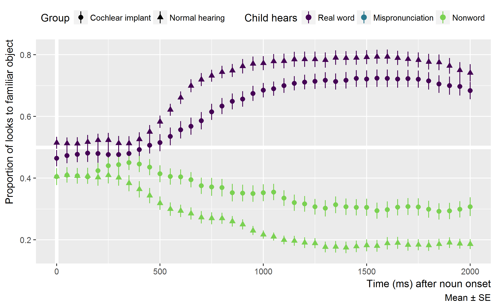

``` r

after_onset %>% 
  ggplot() + 
    theme_grey(base_size = 12) + 
    aes(x = Time, y = Prop, color = Cond_Lab, shape = Group_Lab) + 
    hline_chance() +
    vline_onset() +
    stat_mean_se(data = after_onset, alpha = 0) + 
    stat_mean_se(data = . %>% 
                   filter(Condition %in% c("real", "nonsense", "MP")) %>% 
                   filter(Group == "NormalHearing")) + 
    stat_mean_se(data = . %>% filter(Condition %in% c("real", "nonsense"))) + 
    viridis::scale_color_viridis(end = .8, discrete = TRUE) + 
    labs(
      x = plot_text$x_time, 
      y = plot_text$y_target, 
      caption = plot_text$caption_mean_se,
      color = "Child hears",
      shape = "Group") + 
    legend_top() + 
    align_axis_right() + 
    expand_limits(x = c(.1, .9))
```

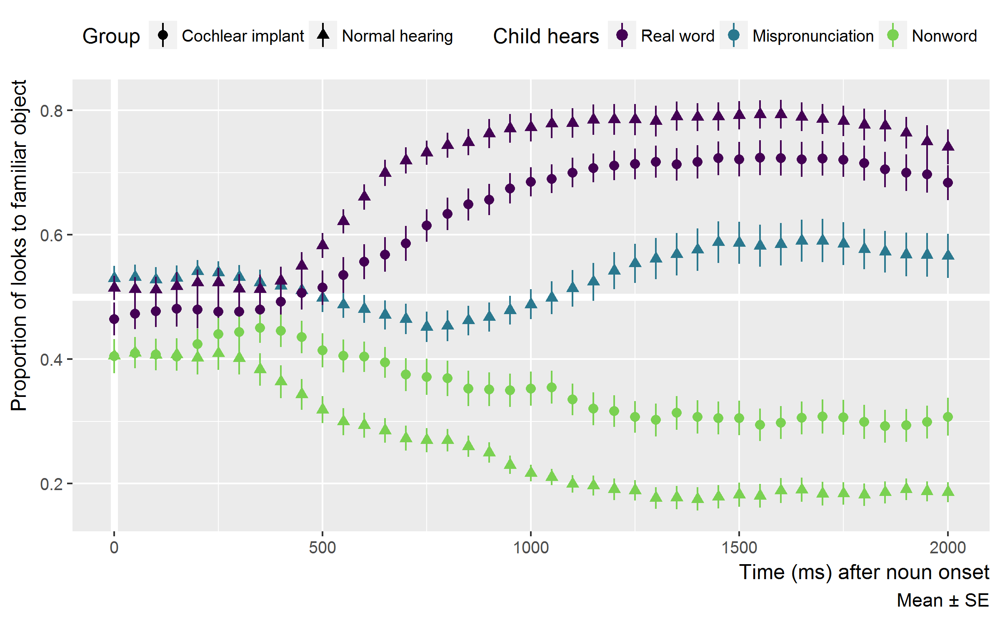

``` r

after_onset %>% 
  ggplot() + 
    theme_grey(base_size = 12) + 
    aes(x = Time, y = Prop, color = Cond_Lab, shape = Group_Lab) + 
    hline_chance() +
    vline_onset() +
    stat_mean_se() + 
    viridis::scale_color_viridis(end = .8, discrete = TRUE) + 
    labs(
      x = plot_text$x_time, 
      y = plot_text$y_target, 
      caption = plot_text$caption_mean_se,
      color = "Child hears",
      shape = "Group") + 
    legend_top() + 
    align_axis_right() + 
    expand_limits(x = c(.1, .9))
```

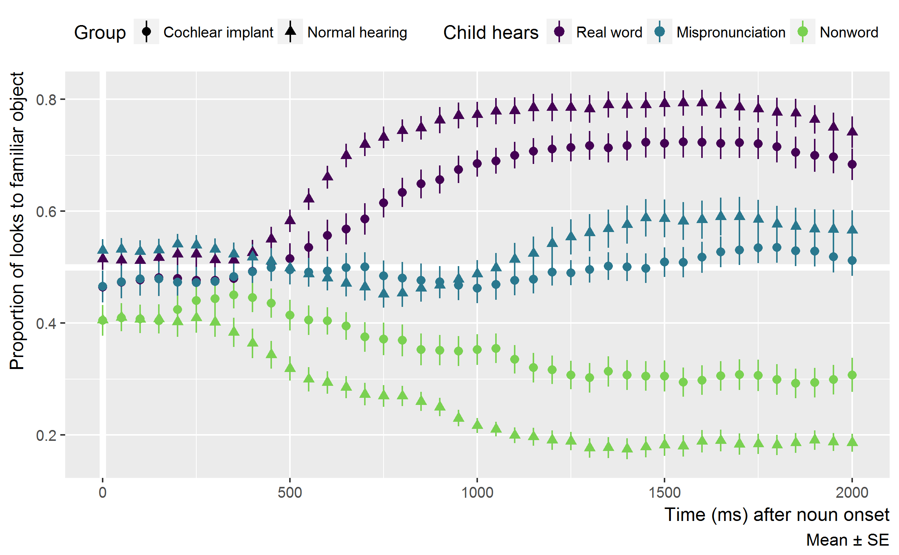

``` r


after_onset %>% 
  ggplot() + 
    theme_grey(base_size = 12) + 
    aes(x = Time, y = Prop, color = Cond_Lab, shape = Group_Lab) + 
    hline_chance() +
    vline_onset() +
    stat_mean_se(data = after_onset, alpha = 0) + 
    stat_mean_se(data = . %>% 
                   filter(Condition %in% c("nonsense")) %>% 
                   filter(Group == "NormalHearing")) + 
    viridis::scale_color_viridis(end = .8, discrete = TRUE) + 
    labs(
      x = plot_text$x_time, 
      y = plot_text$y_target, 
      caption = plot_text$caption_mean_se,
      color = "Child hears",
      shape = "Group") + 
    legend_top() + 
    align_axis_right() + 
    expand_limits(x = c(.1, .9))
```

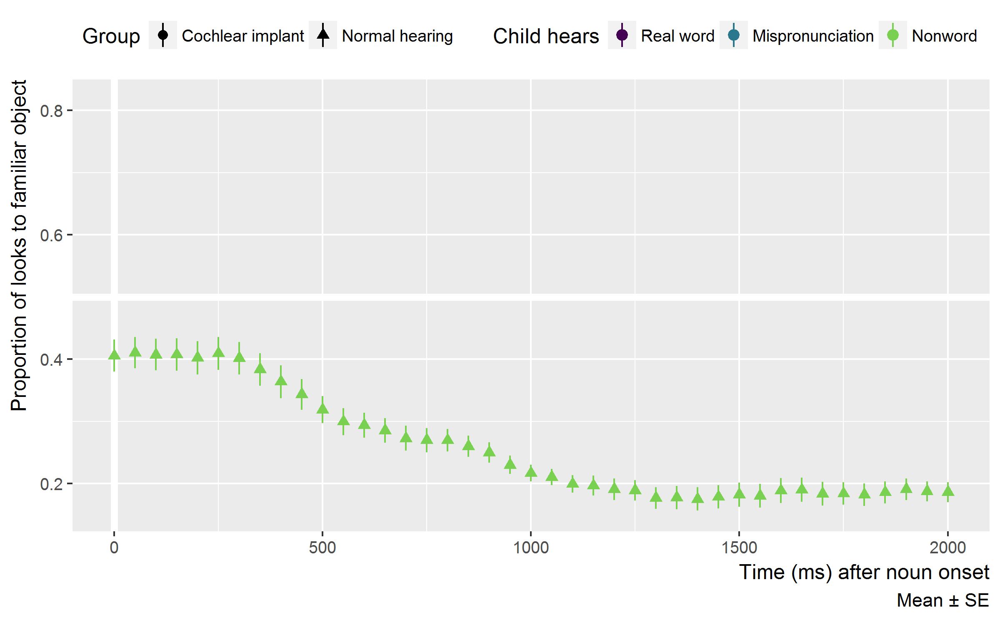

``` r

after_onset %>% 
  ggplot() + 
    theme_grey(base_size = 12) + 
    aes(x = Time, y = Prop, color = Cond_Lab, shape = Group_Lab) + 
    hline_chance() +
    vline_onset() +
    stat_mean_se(data = after_onset, alpha = 0) + 
    stat_mean_se(data = . %>% filter(Condition %in% c("nonsense"))) +
    viridis::scale_color_viridis(end = .8, discrete = TRUE) + 
    labs(
      x = plot_text$x_time, 
      y = plot_text$y_target, 
      caption = plot_text$caption_mean_se,
      color = "Child hears",
      shape = "Group") + 
    legend_top() + 
    align_axis_right() + 
    expand_limits(x = c(.1, .9))
```

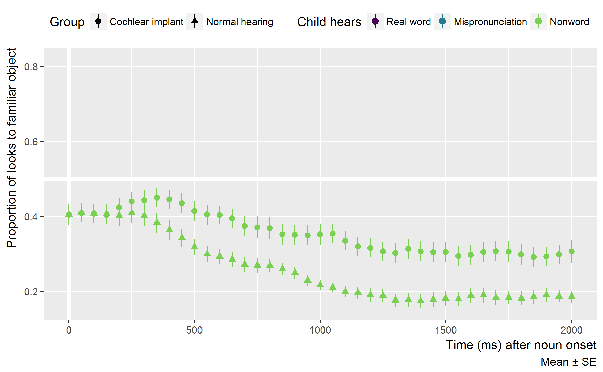

``` r

after_onset %>% 
  ggplot() + 
    theme_grey(base_size = 12) + 
    aes(x = Time, y = Prop, color = Cond_Lab, shape = Group_Lab) + 
    hline_chance() +
    vline_onset() +
    stat_mean_se(data = after_onset, alpha = 0) + 
    stat_mean_se(data = . %>% 
                   filter(Condition %in% c("MP")) %>% 
                   filter(Group == "NormalHearing")) + 
    viridis::scale_color_viridis(end = .8, discrete = TRUE) + 
    labs(
      x = plot_text$x_time, 
      y = plot_text$y_target, 
      caption = plot_text$caption_mean_se,
      color = "Child hears",
      shape = "Group") + 
    legend_top() + 
    align_axis_right() + 
    expand_limits(x = c(.1, .9))
```

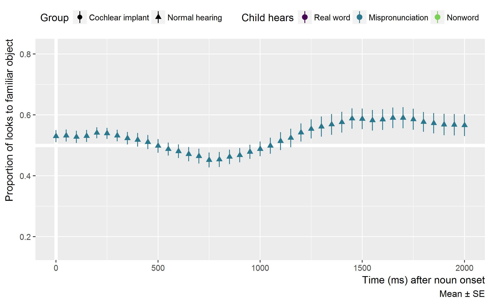

``` r

after_onset %>% 
  ggplot() + 
    theme_grey(base_size = 12) + 
    aes(x = Time, y = Prop, color = Cond_Lab, shape = Group_Lab) + 
    hline_chance() +
    vline_onset() +
    stat_mean_se(data = after_onset, alpha = 0) + 
    stat_mean_se(data = . %>% filter(Condition %in% c("MP"))) +
    viridis::scale_color_viridis(end = .8, discrete = TRUE) + 
    labs(
      x = plot_text$x_time, 
      y = plot_text$y_target, 
      caption = plot_text$caption_mean_se,
      color = "Child hears",
      shape = "Group") + 
    legend_top() + 
    align_axis_right() + 
    expand_limits(x = c(.1, .9))
```

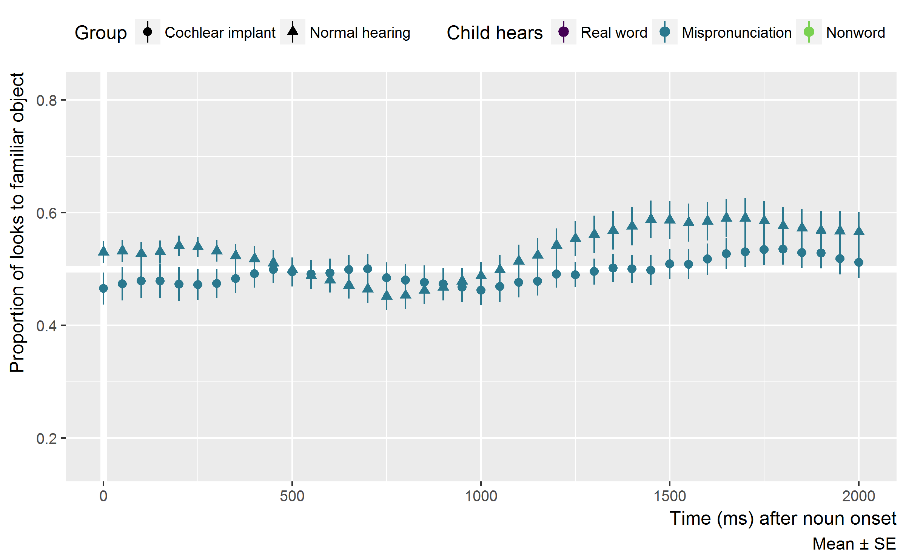

``` r

after_onset %>% 
  ggplot() + 
    theme_grey(base_size = 12) + 
    aes(x = Time, y = Prop, color = Cond_Lab, shape = Group_Lab) + 
    hline_chance() +
    vline_onset() +
    stat_mean_se(data = after_onset, alpha = 0) + 
    stat_mean_se(data = . %>% filter(Condition %in% c("real", "MP"))) +
    viridis::scale_color_viridis(end = .8, discrete = TRUE) + 
    labs(
      x = plot_text$x_time, 
      y = plot_text$y_target, 
      caption = plot_text$caption_mean_se,
      color = "Child hears",
      shape = "Group") + 
    legend_top() + 
    align_axis_right() + 
    expand_limits(x = c(.1, .9))
```

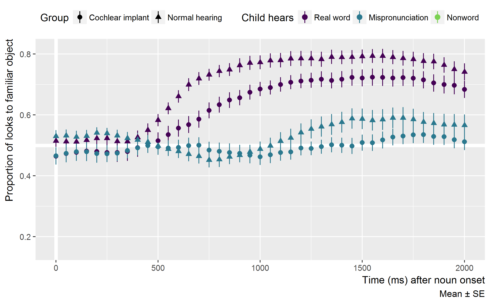

``` r

after_onset %>% 
  ggplot() + 
    theme_grey(base_size = 12) + 
    aes(x = Time, y = Prop, color = Cond_Lab, shape = Group_Lab) + 
    hline_chance() +
    vline_onset() +
    stat_mean_se(data = after_onset, alpha = 0) + 
    stat_mean_se(data = . %>% filter(Condition %in% c("real", "MP"))) +
    viridis::scale_color_viridis(end = .8, discrete = TRUE) + 
    labs(
      x = plot_text$x_time, 
      y = plot_text$y_target, 
      caption = plot_text$caption_mean_se,
      color = "Child hears",
      shape = "Group") + 
    facet_wrap("Group") +
    legend_top() + 
    align_axis_right() + 
    expand_limits(x = c(.1, .9))
```

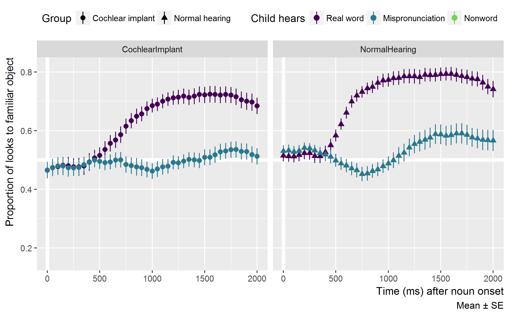

But given that the groups differ in vocabulary, we can see the same pattern of results, kind of, by binning children based on EVT scores.

``` r
binned %>% 
  inner_join(scores) %>% 
  filter(!is.na(EVT_Standard)) %>% 
  ggplot() + 
    aes(x = Time, y = Prop, color = factor(ntile(EVT_GSV, 3))) + 
    hline_chance() +
    vline_onset() +
    stat_mean_se() + 
    viridis::scale_color_viridis(discrete = TRUE, end = .7, option = "B") +
    facet_wrap("Cond_Lab", ncol = 1, scales = "free_x") + 
    labs(
      x = plot_text$x_time, 
      y = plot_text$y_target, 
      caption = plot_text$caption_mean_se,
      color = "EVT-2 GSV score tertile") + 
    legend_top() + 
    align_axis_right()
```

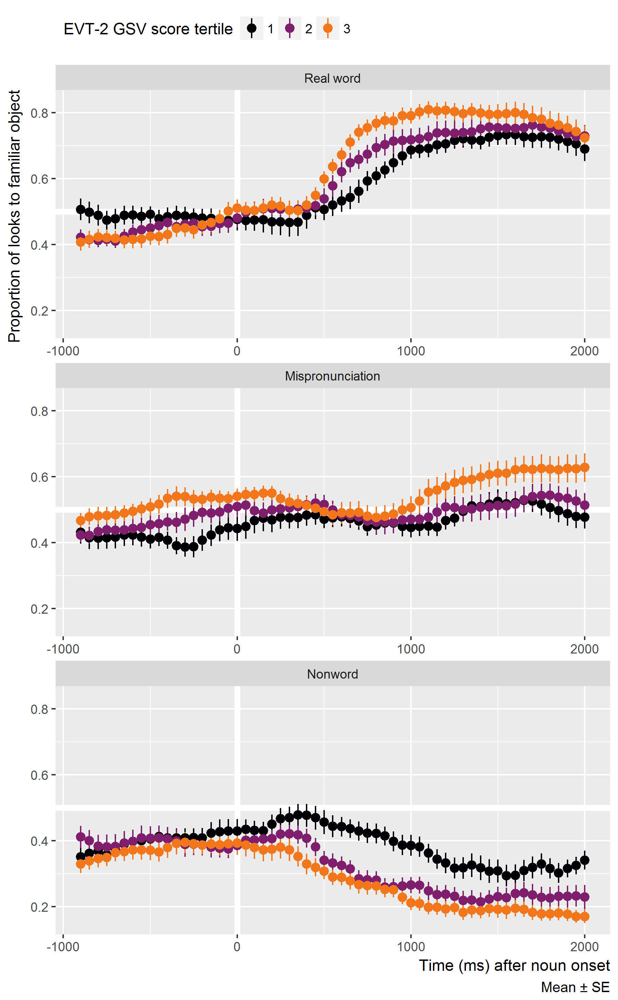

The spaghetti plot shows that there are indeed more low-EVT children in the cochlear implant group.

``` r
binned %>% 
  inner_join(scores) %>% 
  filter(!is.na(EVT_Standard)) %>% 
  filter(0 <= Time) %>% 
  ggplot() + 
    aes(x = Time, y = Prop, color = factor(ntile(EVT_GSV, 3))) + 
    hline_chance() +
    geom_line(aes(group = interaction(Condition, Study, ResearchID))) + 
    viridis::scale_color_viridis(discrete = TRUE, end = .8, option = "B") +
    facet_grid(Cond_Lab ~ Group_Lab, scales = "free_x") + 
    labs(
      x = plot_text$x_time, 
      y = plot_text$y_target, 
      caption = plot_text$caption_mean_se,
      color = "EVT-2 GSV tertile") + 
    legend_top() + 
    align_axis_right()
```

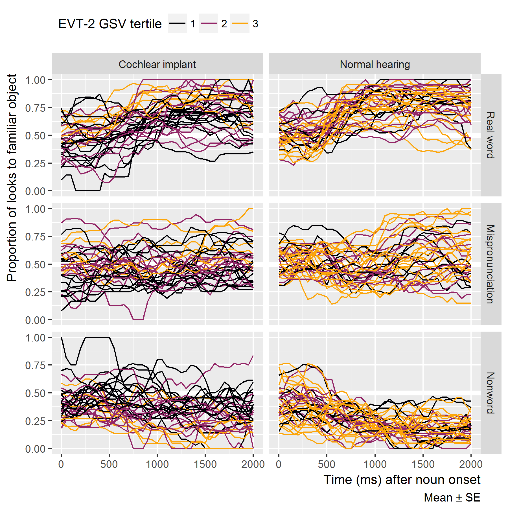

### Get descriptives for slide

``` r
scores %>% 
  distinct(Group, ChildID, Female) %>% 
  group_by(Group) %>% 
  count(Female)
#> # A tibble: 4 x 3
#> # Groups:   Group [2]
#>             Group Female     n
#>             <chr>  <int> <int>
#> 1 CochlearImplant      0    10
#> 2 CochlearImplant      1    15
#> 3   NormalHearing      0    10
#> 4   NormalHearing      1    15

scores %>% 
  distinct(Group, ChildStudyID) %>% 
  count(Group)
#> # A tibble: 2 x 2
#>             Group     n
#>             <chr> <int>
#> 1 CochlearImplant    37
#> 2   NormalHearing    37

scores %>% 
  group_by(Group) %>% 
  summarise(
    Age = mean(EVT_Age) %>% round(),
    Age_SD = sd(EVT_Age) %>% round(),
    Min_Age = min(EVT_Age),
    Max_Age = max(EVT_Age))
#> # A tibble: 2 x 5
#>             Group   Age Age_SD Min_Age Max_Age
#>             <chr> <dbl>  <dbl>   <dbl>   <dbl>
#> 1 CochlearImplant    51      9      34      66
#> 2   NormalHearing    51      9      36      66

scores %>% 
  group_by(Group) %>% 
  summarise(
    EVT = mean(EVT_Standard, na.rm = TRUE) %>% round(),
    EVT_SD = sd(EVT_Standard, na.rm = TRUE) %>% round(),
    Min_EVT = min(EVT_Standard, na.rm = TRUE),
    Max_EVT = max(EVT_Standard, na.rm = TRUE))
#> # A tibble: 2 x 5
#>             Group   EVT EVT_SD Min_EVT Max_EVT
#>             <chr> <dbl>  <dbl>   <dbl>   <dbl>
#> 1 CochlearImplant    97     19      46     131
#> 2   NormalHearing   117     12      88     134

scores %>% 
  distinct(Group, ChildID, Maternal_Education) %>% 
  count(Group, Maternal_Education)
#> # A tibble: 12 x 3
#>              Group           Maternal_Education     n
#>              <chr>                        <chr> <int>
#>  1 CochlearImplant               College Degree    12
#>  2 CochlearImplant              Graduate Degree     6
#>  3 CochlearImplant          High School Diploma     2
#>  4 CochlearImplant      Some College (2+ years)     2
#>  5 CochlearImplant Technical/Associate's Degree     3
#>  6   NormalHearing               College Degree    12
#>  7   NormalHearing              Graduate Degree     6
#>  8   NormalHearing          High School Diploma     1
#>  9   NormalHearing        Less Than High School     1
#> 10   NormalHearing      Some College (2+ years)     2
#> 11   NormalHearing Technical/Associate's Degree     2
#> 12   NormalHearing                 Trade School     1
```

### Save the model-ready data

``` r
zscore <- function(...) as.vector(scale(...))
scores <- scores %>%
  mutate_at(vars(EVT_GSV, EVT_Standard, PPVT_GSV, PPVT_Standard,
         GFTA_Standard), funs(z = zscore))

binned %>% 
  inner_join(scores) %>% 
  select(ChildStudyID, Matching_PairNumber,
         Group:Time, Cond_Lab, Group_Lab, Target, Distractor, Prop,
         EVT_Age, EVT_GSV, EVT_Standard, PPVT_GSV, PPVT_Standard,
         GFTA_Standard, ends_with("_z")) %>% 
  filter(300 <= Time, Time <= 1800) %>% 
  readr::write_csv("./data/model.csv.gz")
```

------------------------------------------------------------------------

``` r
sessioninfo::session_info()
#> - Session info -----------------------------------------------------------------------------------
#>  setting  value                       
#>  version  R version 3.4.1 (2017-06-30)
#>  os       Windows 7 x64 SP 1          
#>  system   x86_64, mingw32             
#>  ui       RTerm                       
#>  language (EN)                        
#>  collate  English_United States.1252  
#>  tz       America/Chicago             
#>  date     2017-11-07                  
#> 
#> - Packages ---------------------------------------------------------------------------------------
#>  package         * version    date       source                                 
#>  assertthat        0.2.0      2017-04-11 CRAN (R 3.3.2)                         
#>  backports         1.1.1      2017-09-25 CRAN (R 3.4.1)                         
#>  bindr             0.1        2016-11-13 CRAN (R 3.4.0)                         
#>  bindrcpp        * 0.2        2017-06-17 CRAN (R 3.4.0)                         
#>  clisymbols        1.2.0      2017-08-04 Github (gaborcsardi/clisymbols@e49b4f5)
#>  colorspace        1.3-2      2016-12-14 CRAN (R 3.3.2)                         
#>  digest            0.6.12     2017-01-27 CRAN (R 3.3.2)                         
#>  dplyr           * 0.7.4      2017-09-28 CRAN (R 3.4.2)                         
#>  evaluate          0.10.1     2017-06-24 CRAN (R 3.4.1)                         
#>  ggplot2         * 2.2.1      2016-12-30 CRAN (R 3.4.1)                         
#>  glue              1.2.0      2017-10-29 CRAN (R 3.4.2)                         
#>  gridExtra         2.3        2017-09-09 CRAN (R 3.4.1)                         
#>  gtable            0.2.0      2016-02-26 CRAN (R 3.2.3)                         
#>  hms               0.3        2016-11-22 CRAN (R 3.3.2)                         
#>  htmltools         0.3.6      2017-04-28 CRAN (R 3.4.0)                         
#>  knitr           * 1.17       2017-08-10 CRAN (R 3.4.2)                         
#>  labeling          0.3        2014-08-23 CRAN (R 3.1.1)                         
#>  lazyeval          0.2.1      2017-10-29 CRAN (R 3.4.2)                         
#>  littlelisteners * 0.0.0.9000 2017-09-22 Github (tjmahr/littlelisteners@44e87a4)
#>  magrittr          1.5        2014-11-22 CRAN (R 3.1.2)                         
#>  munsell           0.4.3      2016-02-13 CRAN (R 3.2.3)                         
#>  pkgconfig         2.0.1      2017-03-21 CRAN (R 3.3.3)                         
#>  plyr              1.8.4      2016-06-08 CRAN (R 3.3.0)                         
#>  purrr             0.2.4      2017-10-18 CRAN (R 3.4.2)                         
#>  R6                2.2.2      2017-06-17 CRAN (R 3.4.0)                         
#>  Rcpp              0.12.13    2017-09-28 CRAN (R 3.4.2)                         
#>  readr             1.1.1      2017-05-16 CRAN (R 3.4.0)                         
#>  reshape2          1.4.2      2016-10-22 CRAN (R 3.3.1)                         
#>  rlang           * 0.1.4      2017-11-05 CRAN (R 3.4.2)                         
#>  rmarkdown         1.6        2017-06-15 CRAN (R 3.4.2)                         
#>  rprojroot         1.2        2017-01-16 CRAN (R 3.3.2)                         
#>  scales            0.5.0      2017-08-24 CRAN (R 3.4.1)                         
#>  sessioninfo       1.0.1      2017-09-13 Github (r-lib/sessioninfo@e813de4)     
#>  stringi           1.1.5      2017-04-07 CRAN (R 3.3.3)                         
#>  stringr           1.2.0      2017-02-18 CRAN (R 3.3.2)                         
#>  tibble            1.3.4      2017-08-22 CRAN (R 3.4.1)                         
#>  tidyr             0.7.2      2017-10-16 CRAN (R 3.4.2)                         
#>  tidyselect        0.2.3      2017-11-06 CRAN (R 3.4.2)                         
#>  viridis           0.4.0      2017-03-27 CRAN (R 3.3.3)                         
#>  viridisLite       0.2.0      2017-03-24 CRAN (R 3.3.2)                         
#>  withr             2.1.0.9000 2017-11-02 Github (jimhester/withr@8ba5e46)       
#>  yaml              2.1.14     2016-11-12 CRAN (R 3.4.2)
```
