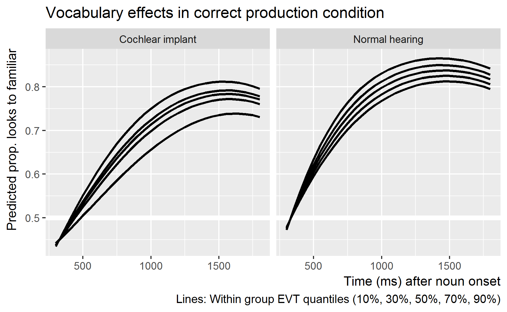

Plot the eyetracking data
================
Tristan Mahr
2017-10-26

-   [Set up](#set-up)
    -   [Add orthogonal polynomials](#add-orthogonal-polynomials)
    -   [Prep the datasets](#prep-the-datasets)
-   [Fit the models](#fit-the-models)
    -   [EVT-less models](#evt-less-models)
    -   [Mispronunciations](#mispronunciations)
    -   [Real words](#real-words)
    -   [Nonword models](#nonword-models)

Set up
------

``` r
library(dplyr)
library(littlelisteners)
library(ggplot2)
library(lme4)

source("./plotting-helpers.R", encoding = "UTF8")
looks <- readr::read_csv("./data/model.csv.gz") %>% 
  mutate(
    Cond_Lab = Condition %>% 
      factor(c("real", "MP", "nonsense"),
             c("Real word", "Mispronunciation", "Nonword")))
```

### Add orthogonal polynomials

``` r
looks <- looks %>% 
  polypoly::poly_add_columns(Time, degree = 3, prefix = "ot") 
```

### Prep the datasets

``` r
d_mp <- looks %>% 
  filter(Condition == "MP")

d_rw <- looks %>% 
  filter(Condition == "real")

d_ns <- looks %>% 
  filter(Condition == "nonsense")
```

We need to remove any pairs of children in which one of the children is missing an EVT score.

``` r
no_vocab_pairs <- looks %>%
  distinct(ChildStudyID, Matching_PairNumber, EVT_Standard) %>%
  filter(is.na(EVT_Standard)) %>%
  select(Matching_PairNumber) %>%
  print()
#> # A tibble: 1 x 1
#>   Matching_PairNumber
#>                 <int>
#> 1                  15
```

Fit the models
--------------

### EVT-less models

``` r
glmer_controls <- glmerControl(
  optimizer = "bobyqa",
  optCtrl = list(maxfun = 2e5))

m_mp <- glmer(
  cbind(Target, Distractor) ~ 
    Group * (ot1 + ot2 + ot3) + (ot1 + ot2 + ot3 | ChildStudyID),
  family = binomial,
  control = glmer_controls,
  data = d_mp)
summary(m_mp)
#> Generalized linear mixed model fit by maximum likelihood (Laplace Approximation) ['glmerMod']
#>  Family: binomial  ( logit )
#> Formula: cbind(Target, Distractor) ~ Group * (ot1 + ot2 + ot3) + (ot1 +  
#>     ot2 + ot3 | ChildStudyID)
#>    Data: d_mp
#> Control: glmer_controls
#> 
#>      AIC      BIC   logLik deviance df.resid 
#>  11917.1  12020.4  -5940.6  11881.1     2276 
#> 
#> Scaled residuals: 
#>      Min       1Q   Median       3Q      Max 
#> -2.40445 -0.41933 -0.00934  0.42238  2.39728 
#> 
#> Random effects:
#>  Groups       Name        Variance Std.Dev. Corr             
#>  ChildStudyID (Intercept) 0.3694   0.6078                    
#>               ot1         3.8897   1.9722    0.46            
#>               ot2         0.8285   0.9102   -0.32 -0.32      
#>               ot3         0.4418   0.6647    0.15 -0.43 -0.07
#> Number of obs: 2294, groups:  ChildStudyID, 74
#> 
#> Fixed effects:
#>                         Estimate Std. Error z value Pr(>|z|)    
#> (Intercept)            -0.004854   0.100360  -0.048   0.9614    
#> GroupNormalHearing      0.154643   0.141891   1.090   0.2758    
#> ot1                     0.327820   0.328509   0.998   0.3183    
#> ot2                     0.296101   0.158533   1.868   0.0618 .  
#> ot3                     0.111082   0.120885   0.919   0.3581    
#> GroupNormalHearing:ot1  0.734386   0.464265   1.582   0.1137    
#> GroupNormalHearing:ot2  0.229322   0.223408   1.026   0.3047    
#> GroupNormalHearing:ot3 -0.680799   0.169981  -4.005  6.2e-05 ***
#> ---
#> Signif. codes:  0 '***' 0.001 '**' 0.01 '*' 0.05 '.' 0.1 ' ' 1
#> 
#> Correlation of Fixed Effects:
#>             (Intr) GrpNrH ot1    ot2    ot3    GrNH:1 GrNH:2
#> GrpNrmlHrng -0.707                                          
#> ot1          0.451 -0.319                                   
#> ot2         -0.299  0.211 -0.298                            
#> ot3          0.132 -0.093 -0.386 -0.054                     
#> GrpNrmlHr:1 -0.319  0.452 -0.707  0.211  0.273              
#> GrpNrmlHr:2  0.212 -0.299  0.211 -0.709  0.039 -0.298       
#> GrpNrmlHr:3 -0.094  0.132  0.275  0.039 -0.711 -0.388 -0.052

m_rw <- glmer(
  cbind(Target, Distractor) ~ 
    Group * (ot1 + ot2 + ot3) + (ot1 + ot2 + ot3 | ChildStudyID),
  family = binomial,
  control = glmer_controls,
  data = d_rw)
summary(m_rw)
#> Generalized linear mixed model fit by maximum likelihood (Laplace Approximation) ['glmerMod']
#>  Family: binomial  ( logit )
#> Formula: cbind(Target, Distractor) ~ Group * (ot1 + ot2 + ot3) + (ot1 +  
#>     ot2 + ot3 | ChildStudyID)
#>    Data: d_rw
#> Control: glmer_controls
#> 
#>      AIC      BIC   logLik deviance df.resid 
#>  11558.8  11662.1  -5761.4  11522.8     2276 
#> 
#> Scaled residuals: 
#>      Min       1Q   Median       3Q      Max 
#> -3.16093 -0.42522  0.00612  0.44104  2.44476 
#> 
#> Random effects:
#>  Groups       Name        Variance Std.Dev. Corr             
#>  ChildStudyID (Intercept) 0.5225   0.7228                    
#>               ot1         4.8612   2.2048    0.49            
#>               ot2         1.7769   1.3330   -0.24 -0.19      
#>               ot3         0.6677   0.8171   -0.28 -0.46  0.34
#> Number of obs: 2294, groups:  ChildStudyID, 74
#> 
#> Fixed effects:
#>                        Estimate Std. Error z value Pr(>|z|)    
#> (Intercept)              0.7337     0.1194   6.146 7.96e-10 ***
#> GroupNormalHearing       0.4500     0.1688   2.665 0.007697 ** 
#> ot1                      2.3730     0.3681   6.447 1.14e-10 ***
#> ot2                     -0.7607     0.2278  -3.340 0.000838 ***
#> ot3                     -0.1179     0.1468  -0.803 0.421818    
#> GroupNormalHearing:ot1   0.2147     0.5203   0.413 0.679883    
#> GroupNormalHearing:ot2  -0.5656     0.3216  -1.759 0.078560 .  
#> GroupNormalHearing:ot3   0.1678     0.2067   0.811 0.417100    
#> ---
#> Signif. codes:  0 '***' 0.001 '**' 0.01 '*' 0.05 '.' 0.1 ' ' 1
#> 
#> Correlation of Fixed Effects:
#>             (Intr) GrpNrH ot1    ot2    ot3    GrNH:1 GrNH:2
#> GrpNrmlHrng -0.707                                          
#> ot1          0.488 -0.345                                   
#> ot2         -0.230  0.163 -0.170                            
#> ot3         -0.255  0.180 -0.407  0.314                     
#> GrpNrmlHr:1 -0.345  0.490 -0.707  0.121  0.288              
#> GrpNrmlHr:2  0.163 -0.231  0.121 -0.707 -0.220 -0.169       
#> GrpNrmlHr:3  0.181 -0.256  0.289 -0.221 -0.707 -0.412  0.317

m_ns <- glmer(
  cbind(Target, Distractor) ~ 
    Group * (ot1 + ot2 + ot3) + (ot1 + ot2 + ot3 | ChildStudyID),
  family = binomial,
  control = glmer_controls,
  data = d_ns)
summary(m_ns)
#> Generalized linear mixed model fit by maximum likelihood (Laplace Approximation) ['glmerMod']
#>  Family: binomial  ( logit )
#> Formula: cbind(Target, Distractor) ~ Group * (ot1 + ot2 + ot3) + (ot1 +  
#>     ot2 + ot3 | ChildStudyID)
#>    Data: d_ns
#> Control: glmer_controls
#> 
#>      AIC      BIC   logLik deviance df.resid 
#>  11534.9  11638.2  -5749.4  11498.9     2276 
#> 
#> Scaled residuals: 
#>      Min       1Q   Median       3Q      Max 
#> -2.74598 -0.46161 -0.02695  0.45878  2.74382 
#> 
#> Random effects:
#>  Groups       Name        Variance Std.Dev. Corr             
#>  ChildStudyID (Intercept) 0.3753   0.6127                    
#>               ot1         5.5977   2.3660    0.47            
#>               ot2         1.6033   1.2662    0.04  0.24      
#>               ot3         1.1856   1.0888   -0.16 -0.41 -0.30
#> Number of obs: 2294, groups:  ChildStudyID, 74
#> 
#> Fixed effects:
#>                        Estimate Std. Error z value Pr(>|z|)    
#> (Intercept)            -0.74499    0.10148  -7.341 2.11e-13 ***
#> GroupNormalHearing     -0.55025    0.14341  -3.837 0.000125 ***
#> ot1                    -1.62901    0.39598  -4.114 3.89e-05 ***
#> ot2                     0.19217    0.21894   0.878 0.380103    
#> ot3                     0.05652    0.18919   0.299 0.765131    
#> GroupNormalHearing:ot1 -0.48871    0.55840  -0.875 0.381464    
#> GroupNormalHearing:ot2  0.30571    0.30795   0.993 0.320848    
#> GroupNormalHearing:ot3  0.01835    0.26714   0.069 0.945227    
#> ---
#> Signif. codes:  0 '***' 0.001 '**' 0.01 '*' 0.05 '.' 0.1 ' ' 1
#> 
#> Correlation of Fixed Effects:
#>             (Intr) GrpNrH ot1    ot2    ot3    GrNH:1 GrNH:2
#> GrpNrmlHrng -0.707                                          
#> ot1          0.465 -0.329                                   
#> ot2          0.047 -0.033  0.239                            
#> ot3         -0.147  0.104 -0.374 -0.245                     
#> GrpNrmlHr:1 -0.330  0.465 -0.708 -0.168  0.265              
#> GrpNrmlHr:2 -0.033  0.044 -0.169 -0.709  0.175  0.235       
#> GrpNrmlHr:3  0.104 -0.149  0.266  0.175 -0.707 -0.380 -0.251
```

### Mispronunciations

<!-- The two groups significantly differ with respect to their intercept terms, and -->
<!-- not the shape of their growth curves. -->
<!-- Now, we have to refit the model the model to exclude _pairs_ of children where one of the children is missing an EVT2 score vocabulary scores. -->
Allow EVT to interact with time, time<sup>2</sup> and time<sup>3</sup> because these data are curvier.

``` r
m_mp_1a <- glmer(
  cbind(Target, Distractor) ~ 
    Group * (1 + ot1 + ot2 + ot3) + (ot1 + ot2 + ot3 | ChildStudyID),
  family = binomial,
  control = glmer_controls,
  data = d_mp %>% anti_join(no_vocab_pairs))
summary(m_mp_1a)
#> Generalized linear mixed model fit by maximum likelihood (Laplace Approximation) ['glmerMod']
#>  Family: binomial  ( logit )
#> Formula: cbind(Target, Distractor) ~ Group * (1 + ot1 + ot2 + ot3) + (ot1 +  
#>     ot2 + ot3 | ChildStudyID)
#>    Data: d_mp %>% anti_join(no_vocab_pairs)
#> Control: glmer_controls
#> 
#>      AIC      BIC   logLik deviance df.resid 
#>  11579.8  11682.6  -5771.9  11543.8     2214 
#> 
#> Scaled residuals: 
#>      Min       1Q   Median       3Q      Max 
#> -2.39938 -0.42304 -0.00919  0.42036  2.39557 
#> 
#> Random effects:
#>  Groups       Name        Variance Std.Dev. Corr             
#>  ChildStudyID (Intercept) 0.3718   0.6098                    
#>               ot1         3.8411   1.9599    0.47            
#>               ot2         0.8374   0.9151   -0.31 -0.35      
#>               ot3         0.4396   0.6630    0.17 -0.42 -0.07
#> Number of obs: 2232, groups:  ChildStudyID, 72
#> 
#> Fixed effects:
#>                        Estimate Std. Error z value Pr(>|z|)    
#> (Intercept)            -0.01067    0.10208  -0.105    0.917    
#> GroupNormalHearing      0.18040    0.14433   1.250    0.211    
#> ot1                     0.41115    0.33111   1.242    0.214    
#> ot2                     0.32094    0.16159   1.986    0.047 *  
#> ot3                     0.09754    0.12240   0.797    0.425    
#> GroupNormalHearing:ot1  0.69373    0.46795   1.482    0.138    
#> GroupNormalHearing:ot2  0.18965    0.22769   0.833    0.405    
#> GroupNormalHearing:ot3 -0.69506    0.17207  -4.039 5.36e-05 ***
#> ---
#> Signif. codes:  0 '***' 0.001 '**' 0.01 '*' 0.05 '.' 0.1 ' ' 1
#> 
#> Correlation of Fixed Effects:
#>             (Intr) GrpNrH ot1    ot2    ot3    GrNH:1 GrNH:2
#> GrpNrmlHrng -0.707                                          
#> ot1          0.460 -0.325                                   
#> ot2         -0.289  0.205 -0.320                            
#> ot3          0.157 -0.111 -0.370 -0.058                     
#> GrpNrmlHr:1 -0.325  0.461 -0.708  0.226  0.262              
#> GrpNrmlHr:2  0.205 -0.290  0.227 -0.710  0.041 -0.320       
#> GrpNrmlHr:3 -0.112  0.157  0.263  0.041 -0.711 -0.372 -0.056

m_mp_2a <- glmer(
  cbind(Target, Distractor) ~ 
    EVT_GSV_z * (1 + ot1 + ot2 + ot3) + (ot1 + ot2 + ot3 | ChildStudyID),
  family = binomial,
  control = glmer_controls,
  data = d_mp %>% anti_join(no_vocab_pairs))
summary(m_mp_2a)
#> Generalized linear mixed model fit by maximum likelihood (Laplace Approximation) ['glmerMod']
#>  Family: binomial  ( logit )
#> Formula: cbind(Target, Distractor) ~ EVT_GSV_z * (1 + ot1 + ot2 + ot3) +  
#>     (ot1 + ot2 + ot3 | ChildStudyID)
#>    Data: d_mp %>% anti_join(no_vocab_pairs)
#> Control: glmer_controls
#> 
#>      AIC      BIC   logLik deviance df.resid 
#>  11583.2  11685.9  -5773.6  11547.2     2214 
#> 
#> Scaled residuals: 
#>      Min       1Q   Median       3Q      Max 
#> -2.37925 -0.42658 -0.00838  0.41904  2.36470 
#> 
#> Random effects:
#>  Groups       Name        Variance Std.Dev. Corr             
#>  ChildStudyID (Intercept) 0.3245   0.5696                    
#>               ot1         3.8271   1.9563    0.45            
#>               ot2         0.8457   0.9196   -0.33 -0.33      
#>               ot3         0.5459   0.7388    0.17 -0.43 -0.11
#> Number of obs: 2232, groups:  ChildStudyID, 72
#> 
#> Fixed effects:
#>               Estimate Std. Error z value Pr(>|z|)    
#> (Intercept)    0.08006    0.06745   1.187 0.235242    
#> EVT_GSV_z      0.23520    0.06749   3.485 0.000492 ***
#> ot1            0.75864    0.23354   3.248 0.001160 ** 
#> ot2            0.41665    0.11438   3.643 0.000270 ***
#> ot3           -0.25415    0.09427  -2.696 0.007016 ** 
#> EVT_GSV_z:ot1  0.36940    0.23370   1.581 0.113956    
#> EVT_GSV_z:ot2  0.03004    0.11466   0.262 0.793306    
#> EVT_GSV_z:ot3 -0.12938    0.09459  -1.368 0.171359    
#> ---
#> Signif. codes:  0 '***' 0.001 '**' 0.01 '*' 0.05 '.' 0.1 ' ' 1
#> 
#> Correlation of Fixed Effects:
#>             (Intr) EVT_GSV_z ot1    ot2    ot3    EVT_GSV_:1 EVT_GSV_:2
#> EVT_GSV_z    0.003                                                     
#> ot1          0.445  0.002                                              
#> ot2         -0.307 -0.001    -0.307                                    
#> ot3          0.157  0.000    -0.387 -0.088                             
#> EVT_GSV_z:1  0.002  0.445     0.003  0.000 -0.001                      
#> EVT_GSV_z:2 -0.001 -0.307     0.000  0.000  0.002 -0.305               
#> EVT_GSV_z:3  0.000  0.157    -0.001  0.002 -0.003 -0.386     -0.084

m_mp_3a <- glmer(
  cbind(Target, Distractor) ~ 
    Group * (1 + ot1 + ot2 + ot3) + 
    EVT_GSV_z * (1 + ot1 + ot2 + ot3) + 
    (ot1 + ot2 + ot3 | ChildStudyID),
  family = binomial,
  control = glmer_controls,
  data = d_mp %>% anti_join(no_vocab_pairs))
summary(m_mp_3a)
#> Generalized linear mixed model fit by maximum likelihood (Laplace Approximation) ['glmerMod']
#>  Family: binomial  ( logit )
#> Formula: cbind(Target, Distractor) ~ Group * (1 + ot1 + ot2 + ot3) + EVT_GSV_z *  
#>     (1 + ot1 + ot2 + ot3) + (ot1 + ot2 + ot3 | ChildStudyID)
#>    Data: d_mp %>% anti_join(no_vocab_pairs)
#> Control: glmer_controls
#> 
#>      AIC      BIC   logLik deviance df.resid 
#>  11577.0  11702.7  -5766.5  11533.0     2210 
#> 
#> Scaled residuals: 
#>      Min       1Q   Median       3Q      Max 
#> -2.40132 -0.42262 -0.00877  0.41963  2.38941 
#> 
#> Random effects:
#>  Groups       Name        Variance Std.Dev. Corr             
#>  ChildStudyID (Intercept) 0.3244   0.5696                    
#>               ot1         3.7784   1.9438    0.46            
#>               ot2         0.8369   0.9148   -0.33 -0.35      
#>               ot3         0.4396   0.6630    0.18 -0.42 -0.07
#> Number of obs: 2232, groups:  ChildStudyID, 72
#> 
#> Fixed effects:
#>                        Estimate Std. Error z value Pr(>|z|)    
#> (Intercept)             0.08947    0.10034   0.892 0.372586    
#> GroupNormalHearing     -0.01859    0.14832  -0.125 0.900270    
#> ot1                     0.52447    0.34526   1.519 0.128742    
#> ot2                     0.31627    0.16972   1.863 0.062397 .  
#> ot3                     0.10543    0.12852   0.820 0.412007    
#> EVT_GSV_z               0.23911    0.07420   3.222 0.001272 ** 
#> GroupNormalHearing:ot1  0.46829    0.51007   0.918 0.358569    
#> GroupNormalHearing:ot2  0.19823    0.25006   0.793 0.427925    
#> GroupNormalHearing:ot3 -0.71001    0.18902  -3.756 0.000172 ***
#> ot1:EVT_GSV_z           0.27172    0.25528   1.064 0.287145    
#> ot2:EVT_GSV_z          -0.01120    0.12538  -0.089 0.928809    
#> ot3:EVT_GSV_z           0.01843    0.09493   0.194 0.846051    
#> ---
#> Signif. codes:  0 '***' 0.001 '**' 0.01 '*' 0.05 '.' 0.1 ' ' 1
#> 
#> Correlation of Fixed Effects:
#>             (Intr) GrpNrH ot1    ot2    ot3    EVT_GS GrNH:1 GrNH:2 GrNH:3 o1:EVT o2:EVT
#> GrpNrmlHrng -0.740                                                                      
#> ot1          0.448 -0.332                                                               
#> ot2         -0.306  0.227 -0.321                                                        
#> ot3          0.160 -0.119 -0.376 -0.058                                                 
#> EVT_GSV_z    0.310 -0.416  0.139 -0.095  0.050                                          
#> GrpNrmlHr:1 -0.332  0.449 -0.740  0.238  0.279 -0.186                                   
#> GrpNrmlHr:2  0.228 -0.307  0.238 -0.742  0.044  0.128 -0.322                            
#> GrpNrmlHr:3 -0.119  0.160  0.280  0.044 -0.743 -0.067 -0.378 -0.058                     
#> o1:EVT_GSV_  0.139 -0.186  0.309 -0.099 -0.117  0.449 -0.415  0.134  0.158              
#> o2:EVT_GSV_ -0.095  0.128 -0.099  0.307 -0.017 -0.307  0.134 -0.414  0.025 -0.320       
#> o3:EVT_GSV_  0.050 -0.067 -0.117 -0.017  0.305  0.159  0.157  0.025 -0.414 -0.377 -0.053

m_mp_3b <- glmer(
  cbind(Target, Distractor) ~ 
    Group * EVT_GSV_z * (1 + ot1 + ot2 + ot3) + 
    (ot1 + ot2 + ot3 | ChildStudyID),
  family = binomial,
  control = glmer_controls,
  data = d_mp %>% anti_join(no_vocab_pairs))
summary(m_mp_3b)
#> Generalized linear mixed model fit by maximum likelihood (Laplace Approximation) ['glmerMod']
#>  Family: binomial  ( logit )
#> Formula: cbind(Target, Distractor) ~ Group * EVT_GSV_z * (1 + ot1 + ot2 +  
#>     ot3) + (ot1 + ot2 + ot3 | ChildStudyID)
#>    Data: d_mp %>% anti_join(no_vocab_pairs)
#> Control: glmer_controls
#> 
#>      AIC      BIC   logLik deviance df.resid 
#>  11582.9  11731.4  -5765.5  11530.9     2206 
#> 
#> Scaled residuals: 
#>      Min       1Q   Median       3Q      Max 
#> -2.40132 -0.41913 -0.00741  0.41865  2.39107 
#> 
#> Random effects:
#>  Groups       Name        Variance Std.Dev. Corr             
#>  ChildStudyID (Intercept) 0.3244   0.5696                    
#>               ot1         3.7072   1.9254    0.46            
#>               ot2         0.8316   0.9119   -0.33 -0.34      
#>               ot3         0.4365   0.6607    0.18 -0.42 -0.08
#> Number of obs: 2232, groups:  ChildStudyID, 72
#> 
#> Fixed effects:
#>                                  Estimate Std. Error z value Pr(>|z|)    
#> (Intercept)                       0.09196    0.10165   0.905 0.365658    
#> GroupNormalHearing               -0.01222    0.15422  -0.079 0.936843    
#> EVT_GSV_z                         0.24497    0.08374   2.925 0.003442 ** 
#> ot1                               0.45941    0.34663   1.325 0.185052    
#> ot2                               0.33355    0.17144   1.946 0.051705 .  
#> ot3                               0.11899    0.12980   0.917 0.359287    
#> GroupNormalHearing:EVT_GSV_z     -0.02703    0.18064  -0.150 0.881045    
#> GroupNormalHearing:ot1            0.29984    0.52558   0.570 0.568345    
#> GroupNormalHearing:ot2            0.24291    0.25915   0.937 0.348584    
#> GroupNormalHearing:ot3           -0.67521    0.19583  -3.448 0.000565 ***
#> EVT_GSV_z:ot1                     0.11674    0.28550   0.409 0.682615    
#> EVT_GSV_z:ot2                     0.02992    0.14123   0.212 0.832229    
#> EVT_GSV_z:ot3                     0.05073    0.10706   0.474 0.635600    
#> GroupNormalHearing:EVT_GSV_z:ot1  0.71998    0.61583   1.169 0.242351    
#> GroupNormalHearing:EVT_GSV_z:ot2 -0.19018    0.30364  -0.626 0.531105    
#> GroupNormalHearing:EVT_GSV_z:ot3 -0.14996    0.22917  -0.654 0.512874    
#> ---
#> Signif. codes:  0 '***' 0.001 '**' 0.01 '*' 0.05 '.' 0.1 ' ' 1
```


### Real words

Only allow EVT to interact with time<sup>1</sup>.

``` r
m_rw_1a <- glmer(
  cbind(Target, Distractor) ~ 
    Group * (1 + ot1 + ot2 + ot3) + (ot1 + ot2 + ot3 | ChildStudyID),
  family = binomial,
  control = glmer_controls,
  data = d_rw %>% anti_join(no_vocab_pairs))
summary(m_rw_1a)
#> Generalized linear mixed model fit by maximum likelihood (Laplace Approximation) ['glmerMod']
#>  Family: binomial  ( logit )
#> Formula: cbind(Target, Distractor) ~ Group * (1 + ot1 + ot2 + ot3) + (ot1 +  
#>     ot2 + ot3 | ChildStudyID)
#>    Data: d_rw %>% anti_join(no_vocab_pairs)
#> Control: glmer_controls
#> 
#>      AIC      BIC   logLik deviance df.resid 
#>  11229.5  11332.3  -5596.7  11193.5     2214 
#> 
#> Scaled residuals: 
#>     Min      1Q  Median      3Q     Max 
#> -3.1823 -0.4226  0.0039  0.4436  2.4463 
#> 
#> Random effects:
#>  Groups       Name        Variance Std.Dev. Corr             
#>  ChildStudyID (Intercept) 0.5384   0.7337                    
#>               ot1         4.7604   2.1818    0.51            
#>               ot2         1.8305   1.3530   -0.24 -0.18      
#>               ot3         0.6799   0.8245   -0.28 -0.44  0.35
#> Number of obs: 2232, groups:  ChildStudyID, 72
#> 
#> Fixed effects:
#>                        Estimate Std. Error z value Pr(>|z|)    
#> (Intercept)              0.7343     0.1228   5.978 2.26e-09 ***
#> GroupNormalHearing       0.4530     0.1737   2.607 0.009124 ** 
#> ot1                      2.4761     0.3695   6.701 2.07e-11 ***
#> ot2                     -0.7779     0.2343  -3.321 0.000899 ***
#> ot3                     -0.1233     0.1502  -0.821 0.411515    
#> GroupNormalHearing:ot1   0.1734     0.5224   0.332 0.739879    
#> GroupNormalHearing:ot2  -0.5336     0.3307  -1.613 0.106676    
#> GroupNormalHearing:ot3   0.1441     0.2114   0.682 0.495441    
#> ---
#> Signif. codes:  0 '***' 0.001 '**' 0.01 '*' 0.05 '.' 0.1 ' ' 1
#> 
#> Correlation of Fixed Effects:
#>             (Intr) GrpNrH ot1    ot2    ot3    GrNH:1 GrNH:2
#> GrpNrmlHrng -0.707                                          
#> ot1          0.501 -0.354                                   
#> ot2         -0.230  0.163 -0.167                            
#> ot3         -0.254  0.180 -0.397  0.326                     
#> GrpNrmlHr:1 -0.354  0.502 -0.707  0.119  0.281              
#> GrpNrmlHr:2  0.163 -0.231  0.118 -0.707 -0.229 -0.166       
#> GrpNrmlHr:3  0.180 -0.256  0.283 -0.230 -0.707 -0.402  0.330

m_rw_2a <- glmer(
  cbind(Target, Distractor) ~ 
    EVT_GSV_z * (1 + ot1) + ot2 + ot3 + (ot1 + ot2 + ot3 | ChildStudyID),
  family = binomial,
  control = glmer_controls,
  data = d_rw %>% anti_join(no_vocab_pairs))
summary(m_rw_2a)
#> Generalized linear mixed model fit by maximum likelihood (Laplace Approximation) ['glmerMod']
#>  Family: binomial  ( logit )
#> Formula: cbind(Target, Distractor) ~ EVT_GSV_z * (1 + ot1) + ot2 + ot3 +  
#>     (ot1 + ot2 + ot3 | ChildStudyID)
#>    Data: d_rw %>% anti_join(no_vocab_pairs)
#> Control: glmer_controls
#> 
#>      AIC      BIC   logLik deviance df.resid 
#>  11229.2  11320.6  -5598.6  11197.2     2216 
#> 
#> Scaled residuals: 
#>     Min      1Q  Median      3Q     Max 
#> -3.1909 -0.4300  0.0027  0.4454  2.4627 
#> 
#> Random effects:
#>  Groups       Name        Variance Std.Dev. Corr             
#>  ChildStudyID (Intercept) 0.5307   0.7285                    
#>               ot1         4.7063   2.1694    0.48            
#>               ot2         1.9091   1.3817   -0.22 -0.15      
#>               ot3         0.6881   0.8295   -0.28 -0.45  0.32
#> Number of obs: 2232, groups:  ChildStudyID, 72
#> 
#> Fixed effects:
#>               Estimate Std. Error z value Pr(>|z|)    
#> (Intercept)    0.96170    0.08628  11.146  < 2e-16 ***
#> EVT_GSV_z      0.23026    0.08605   2.676  0.00745 ** 
#> ot1            2.56536    0.25997   9.868  < 2e-16 ***
#> ot2           -1.04485    0.16904  -6.181 6.37e-10 ***
#> ot3           -0.05011    0.10670  -0.470  0.63862    
#> EVT_GSV_z:ot1  0.31969    0.24592   1.300  0.19361    
#> ---
#> Signif. codes:  0 '***' 0.001 '**' 0.01 '*' 0.05 '.' 0.1 ' ' 1
#> 
#> Correlation of Fixed Effects:
#>             (Intr) EVT_GSV_z ot1    ot2    ot3   
#> EVT_GSV_z    0.005                               
#> ot1          0.481  0.009                        
#> ot2         -0.209  0.009    -0.134              
#> ot3         -0.255  0.002    -0.405  0.310       
#> EVT_GSV_z:1  0.004  0.426     0.008  0.013  0.000

m_rw_3a <- glmer(
  cbind(Target, Distractor) ~ 
    Group * (1 + ot1 + ot2 + ot3) + 
    EVT_GSV_z * (1 + ot1) + 
    (ot1 + ot2 + ot3 | ChildStudyID),
  family = binomial,
  control = glmer_controls,
  data = d_rw %>% anti_join(no_vocab_pairs))
summary(m_rw_3a)
#> Generalized linear mixed model fit by maximum likelihood (Laplace Approximation) ['glmerMod']
#>  Family: binomial  ( logit )
#> Formula: cbind(Target, Distractor) ~ Group * (1 + ot1 + ot2 + ot3) + EVT_GSV_z *  
#>     (1 + ot1) + (ot1 + ot2 + ot3 | ChildStudyID)
#>    Data: d_rw %>% anti_join(no_vocab_pairs)
#> Control: glmer_controls
#> 
#>      AIC      BIC   logLik deviance df.resid 
#>  11229.8  11344.0  -5594.9  11189.8     2212 
#> 
#> Scaled residuals: 
#>     Min      1Q  Median      3Q     Max 
#> -3.1859 -0.4229  0.0016  0.4453  2.4506 
#> 
#> Random effects:
#>  Groups       Name        Variance Std.Dev. Corr             
#>  ChildStudyID (Intercept) 0.5107   0.7146                    
#>               ot1         4.6930   2.1663    0.50            
#>               ot2         1.8305   1.3530   -0.21 -0.16      
#>               ot3         0.6842   0.8272   -0.29 -0.45  0.35
#> Number of obs: 2232, groups:  ChildStudyID, 72
#> 
#> Fixed effects:
#>                        Estimate Std. Error z value Pr(>|z|)    
#> (Intercept)             0.80668    0.12562   6.422 1.35e-10 ***
#> GroupNormalHearing      0.30919    0.18538   1.668 0.095336 .  
#> ot1                     2.61023    0.38386   6.800 1.05e-11 ***
#> ot2                    -0.77583    0.23428  -3.312 0.000928 ***
#> ot3                    -0.12283    0.15054  -0.816 0.414524    
#> EVT_GSV_z               0.17233    0.09085   1.897 0.057839 .  
#> GroupNormalHearing:ot1 -0.09201    0.56430  -0.163 0.870479    
#> GroupNormalHearing:ot2 -0.53624    0.33076  -1.621 0.104968    
#> GroupNormalHearing:ot3  0.14172    0.21199   0.669 0.503783    
#> ot1:EVT_GSV_z           0.31422    0.26508   1.185 0.235874    
#> ---
#> Signif. codes:  0 '***' 0.001 '**' 0.01 '*' 0.05 '.' 0.1 ' ' 1
#> 
#> Correlation of Fixed Effects:
#>             (Intr) GrpNrH ot1    ot2    ot3    EVT_GS GrNH:1 GrNH:2 GrNH:3
#> GrpNrmlHrng -0.739                                                        
#> ot1          0.486 -0.355                                                 
#> ot2         -0.186  0.125 -0.136                                          
#> ot3         -0.255  0.172 -0.384  0.326                                   
#> EVT_GSV_z    0.304 -0.408  0.130  0.006  0.005                            
#> GrpNrmlHr:1 -0.356  0.482 -0.737  0.091  0.261 -0.171                     
#> GrpNrmlHr:2  0.133 -0.180  0.097 -0.707 -0.229 -0.001 -0.130              
#> GrpNrmlHr:3  0.181 -0.246  0.272 -0.230 -0.707 -0.005 -0.373  0.330       
#> o1:EVT_GSV_  0.134 -0.178  0.294  0.013  0.004  0.434 -0.394 -0.009 -0.005

m_rw_3b <- glmer(
  cbind(Target, Distractor) ~ 
    Group * (1 + ot1 + ot2 + ot3) + 
    Group * EVT_GSV_z * (1 + ot1) + 
    (ot1 + ot2 + ot3 | ChildStudyID),
  family = binomial,
  control = glmer_controls,
  data = d_rw %>% anti_join(no_vocab_pairs))
summary(m_rw_3b)
#> Generalized linear mixed model fit by maximum likelihood (Laplace Approximation) ['glmerMod']
#>  Family: binomial  ( logit )
#> Formula: cbind(Target, Distractor) ~ Group * (1 + ot1 + ot2 + ot3) + Group *  
#>     EVT_GSV_z * (1 + ot1) + (ot1 + ot2 + ot3 | ChildStudyID)
#>    Data: d_rw %>% anti_join(no_vocab_pairs)
#> Control: glmer_controls
#> 
#>      AIC      BIC   logLik deviance df.resid 
#>  11229.7  11355.4  -5592.9  11185.7     2210 
#> 
#> Scaled residuals: 
#>     Min      1Q  Median      3Q     Max 
#> -3.1797 -0.4221  0.0001  0.4466  2.4464 
#> 
#> Random effects:
#>  Groups       Name        Variance Std.Dev. Corr             
#>  ChildStudyID (Intercept) 0.4890   0.6993                    
#>               ot1         4.4087   2.0997    0.47            
#>               ot2         1.8324   1.3537   -0.24 -0.19      
#>               ot3         0.6827   0.8263   -0.26 -0.42  0.35
#> Number of obs: 2232, groups:  ChildStudyID, 72
#> 
#> Fixed effects:
#>                                  Estimate Std. Error z value Pr(>|z|)    
#> (Intercept)                       0.83695    0.12435   6.731 1.69e-11 ***
#> GroupNormalHearing                0.40150    0.18974   2.116  0.03434 *  
#> ot1                               2.70163    0.37691   7.168 7.62e-13 ***
#> ot2                              -0.77608    0.23440  -3.311  0.00093 ***
#> ot3                              -0.12135    0.15045  -0.807  0.41989    
#> EVT_GSV_z                         0.24487    0.09917   2.469  0.01354 *  
#> GroupNormalHearing:ot1            0.19081    0.57202   0.334  0.73870    
#> GroupNormalHearing:ot2           -0.53549    0.33092  -1.618  0.10563    
#> GroupNormalHearing:ot3            0.14341    0.21184   0.677  0.49842    
#> GroupNormalHearing:EVT_GSV_z     -0.36995    0.22076  -1.676  0.09378 .  
#> ot1:EVT_GSV_z                     0.53620    0.28952   1.852  0.06402 .  
#> GroupNormalHearing:ot1:EVT_GSV_z -1.13001    0.64393  -1.755  0.07928 .  
#> ---
#> Signif. codes:  0 '***' 0.001 '**' 0.01 '*' 0.05 '.' 0.1 ' ' 1
#> 
#> Correlation of Fixed Effects:
#>             (Intr) GrpNrH ot1    ot2    ot3    EVT_GS GrNH:1 GrNH:2 GrNH:3 GNH:EV o1:EVT
#> GrpNrmlHrng -0.657                                                                      
#> ot1          0.459 -0.302                                                               
#> ot2         -0.209  0.138 -0.160                                                        
#> ot3         -0.220  0.146 -0.353  0.329                                                 
#> EVT_GSV_z    0.335 -0.226  0.138  0.007  0.007                                          
#> GrpNrmlHr:1 -0.302  0.452 -0.660  0.105  0.237 -0.090                                   
#> GrpNrmlHr:2  0.150 -0.196  0.115 -0.707 -0.231 -0.001 -0.148                            
#> GrpNrmlHr:3  0.157 -0.204  0.252 -0.232 -0.707 -0.002 -0.334  0.332                     
#> GNH:EVT_GSV -0.146 -0.290 -0.058 -0.004 -0.006 -0.437 -0.116  0.000 -0.005              
#> o1:EVT_GSV_  0.141 -0.094  0.328  0.013  0.009  0.414 -0.219 -0.007 -0.004 -0.182       
#> GNH:1:EVT_G -0.062 -0.119 -0.144 -0.004 -0.012 -0.184 -0.282 -0.003 -0.001  0.412 -0.440
```



### Nonword models

Allow EVT to interact with time<sup>1</sup>.

``` r
m_ns_1a <- glmer(
  cbind(Target, Distractor) ~ 
    Group * (1 + ot1) + ot2 + ot3 + (ot1 + ot2 + ot3 | ChildStudyID),
  family = binomial,
  control = glmer_controls,
  data = d_ns %>% anti_join(no_vocab_pairs))
summary(m_ns_1a)
#> Generalized linear mixed model fit by maximum likelihood (Laplace Approximation) ['glmerMod']
#>  Family: binomial  ( logit )
#> Formula: cbind(Target, Distractor) ~ Group * (1 + ot1) + ot2 + ot3 + (ot1 +  
#>     ot2 + ot3 | ChildStudyID)
#>    Data: d_ns %>% anti_join(no_vocab_pairs)
#> Control: glmer_controls
#> 
#>      AIC      BIC   logLik deviance df.resid 
#>  11234.3  11325.6  -5601.1  11202.3     2216 
#> 
#> Scaled residuals: 
#>      Min       1Q   Median       3Q      Max 
#> -2.75401 -0.45857 -0.02161  0.46262  2.79496 
#> 
#> Random effects:
#>  Groups       Name        Variance Std.Dev. Corr             
#>  ChildStudyID (Intercept) 0.3713   0.6093                    
#>               ot1         5.6498   2.3769    0.46            
#>               ot2         1.6375   1.2797    0.06  0.24      
#>               ot3         1.0864   1.0423   -0.11 -0.38 -0.30
#> Number of obs: 2232, groups:  ChildStudyID, 72
#> 
#> Fixed effects:
#>                        Estimate Std. Error z value Pr(>|z|)    
#> (Intercept)            -0.73810    0.10243  -7.206 5.77e-13 ***
#> GroupNormalHearing     -0.53385    0.14506  -3.680 0.000233 ***
#> ot1                    -1.58575    0.38863  -4.080 4.50e-05 ***
#> ot2                     0.31183    0.15808   1.973 0.048545 *  
#> ot3                     0.04995    0.13045   0.383 0.701774    
#> GroupNormalHearing:ot1 -0.53819    0.52867  -1.018 0.308679    
#> ---
#> Signif. codes:  0 '***' 0.001 '**' 0.01 '*' 0.05 '.' 0.1 ' ' 1
#> 
#> Correlation of Fixed Effects:
#>             (Intr) GrpNrH ot1    ot2    ot3   
#> GrpNrmlHrng -0.708                            
#> ot1          0.449 -0.303                     
#> ot2          0.040  0.004  0.176              
#> ot3         -0.073  0.003 -0.256 -0.244       
#> GrpNrmlHr:1 -0.316  0.447 -0.681  0.004  0.002

m_ns_2a <- glmer(
  cbind(Target, Distractor) ~ 
    EVT_GSV_z * (1 + ot1) + ot2 + ot3 + (ot1 + ot2 + ot3 | ChildStudyID),
  family = binomial,
  control = glmer_controls,
  data = d_ns %>% anti_join(no_vocab_pairs))
summary(m_ns_2a)
#> Generalized linear mixed model fit by maximum likelihood (Laplace Approximation) ['glmerMod']
#>  Family: binomial  ( logit )
#> Formula: cbind(Target, Distractor) ~ EVT_GSV_z * (1 + ot1) + ot2 + ot3 +  
#>     (ot1 + ot2 + ot3 | ChildStudyID)
#>    Data: d_ns %>% anti_join(no_vocab_pairs)
#> Control: glmer_controls
#> 
#>      AIC      BIC   logLik deviance df.resid 
#>  11227.4  11318.7  -5597.7  11195.4     2216 
#> 
#> Scaled residuals: 
#>      Min       1Q   Median       3Q      Max 
#> -2.75440 -0.45644 -0.02429  0.46163  2.70958 
#> 
#> Random effects:
#>  Groups       Name        Variance Std.Dev. Corr             
#>  ChildStudyID (Intercept) 0.3415   0.5844                    
#>               ot1         5.5813   2.3625    0.44            
#>               ot2         1.6299   1.2767    0.02  0.23      
#>               ot3         1.0829   1.0406   -0.18 -0.42 -0.30
#> Number of obs: 2232, groups:  ChildStudyID, 72
#> 
#> Fixed effects:
#>               Estimate Std. Error z value Pr(>|z|)    
#> (Intercept)   -1.00615    0.06940 -14.498  < 2e-16 ***
#> EVT_GSV_z     -0.32791    0.06892  -4.758 1.95e-06 ***
#> ot1           -1.85436    0.28294  -6.554 5.61e-11 ***
#> ot2            0.31633    0.15765   2.007   0.0448 *  
#> ot3            0.05420    0.13021   0.416   0.6772    
#> EVT_GSV_z:ot1 -0.46303    0.25986  -1.782   0.0748 .  
#> ---
#> Signif. codes:  0 '***' 0.001 '**' 0.01 '*' 0.05 '.' 0.1 ' ' 1
#> 
#> Correlation of Fixed Effects:
#>             (Intr) EVT_GSV_z ot1    ot2    ot3   
#> EVT_GSV_z    0.005                               
#> ot1          0.438  0.005                        
#> ot2          0.023  0.001     0.234              
#> ot3         -0.169 -0.001    -0.379 -0.249       
#> EVT_GSV_z:1  0.005  0.416     0.008  0.005  0.000

m_ns_3a <- glmer(
  cbind(Target, Distractor) ~ 
    Group * (1 + ot1 + ot2 + ot3) + 
    EVT_GSV_z * (1 + ot1) + 
    (ot1 + ot2 + ot3 | ChildStudyID),
  family = binomial,
  control = glmer_controls,
  data = d_ns %>% anti_join(no_vocab_pairs))
summary(m_ns_3a)
#> Generalized linear mixed model fit by maximum likelihood (Laplace Approximation) ['glmerMod']
#>  Family: binomial  ( logit )
#> Formula: cbind(Target, Distractor) ~ Group * (1 + ot1 + ot2 + ot3) + EVT_GSV_z *  
#>     (1 + ot1) + (ot1 + ot2 + ot3 | ChildStudyID)
#>    Data: d_ns %>% anti_join(no_vocab_pairs)
#> Control: glmer_controls
#> 
#>      AIC      BIC   logLik deviance df.resid 
#>  11229.3  11343.5  -5594.6  11189.3     2212 
#> 
#> Scaled residuals: 
#>      Min       1Q   Median       3Q      Max 
#> -2.74976 -0.45788 -0.02647  0.46007  2.70574 
#> 
#> Random effects:
#>  Groups       Name        Variance Std.Dev. Corr             
#>  ChildStudyID (Intercept) 0.3203   0.5659                    
#>               ot1         5.5747   2.3611    0.45            
#>               ot2         1.5988   1.2644    0.05  0.24      
#>               ot3         1.0802   1.0393   -0.18 -0.41 -0.30
#> Number of obs: 2232, groups:  ChildStudyID, 72
#> 
#> Fixed effects:
#>                        Estimate Std. Error z value Pr(>|z|)    
#> (Intercept)            -0.85358    0.10018  -8.521  < 2e-16 ***
#> GroupNormalHearing     -0.30431    0.14792  -2.057 0.039660 *  
#> ot1                    -1.84677    0.41933  -4.404 1.06e-05 ***
#> ot2                     0.13780    0.22178   0.621 0.534375    
#> ot3                     0.10082    0.18408   0.548 0.583900    
#> EVT_GSV_z              -0.26232    0.07359  -3.565 0.000364 ***
#> GroupNormalHearing:ot1 -0.01545    0.61441  -0.025 0.979935    
#> GroupNormalHearing:ot2  0.35369    0.31171   1.135 0.256504    
#> GroupNormalHearing:ot3 -0.09483    0.25966  -0.365 0.714964    
#> ot1:EVT_GSV_z          -0.42565    0.28620  -1.487 0.136956    
#> ---
#> Signif. codes:  0 '***' 0.001 '**' 0.01 '*' 0.05 '.' 0.1 ' ' 1
#> 
#> Correlation of Fixed Effects:
#>             (Intr) GrpNrH ot1    ot2    ot3    EVT_GS GrNH:1 GrNH:2 GrNH:3
#> GrpNrmlHrng -0.741                                                        
#> ot1          0.447 -0.328                                                 
#> ot2          0.057 -0.038  0.232                                          
#> ot3         -0.158  0.108 -0.355 -0.244                                   
#> EVT_GSV_z    0.312 -0.417  0.126  0.001 -0.001                            
#> GrpNrmlHr:1 -0.331  0.444 -0.738 -0.159  0.242 -0.168                     
#> GrpNrmlHr:2 -0.040  0.051 -0.165 -0.709  0.175 -0.002  0.220              
#> GrpNrmlHr:3  0.112 -0.153  0.252  0.175 -0.708 -0.002 -0.347 -0.251       
#> o1:EVT_GSV_  0.136 -0.179  0.294  0.008  0.001  0.423 -0.393 -0.007 -0.001

m_ns_3b <- glmer(
  cbind(Target, Distractor) ~ 
    Group * (1 + ot1 + ot2 + ot3) + 
    Group * EVT_GSV_z * (1 + ot1) + 
    (ot1 + ot2 + ot3 | ChildStudyID),
  family = binomial,
  control = glmer_controls,
  data = d_ns %>% anti_join(no_vocab_pairs))
summary(m_ns_3b)
#> Generalized linear mixed model fit by maximum likelihood (Laplace Approximation) ['glmerMod']
#>  Family: binomial  ( logit )
#> Formula: cbind(Target, Distractor) ~ Group * (1 + ot1 + ot2 + ot3) + Group *  
#>     EVT_GSV_z * (1 + ot1) + (ot1 + ot2 + ot3 | ChildStudyID)
#>    Data: d_ns %>% anti_join(no_vocab_pairs)
#> Control: glmer_controls
#> 
#>      AIC      BIC   logLik deviance df.resid 
#>  11231.3  11356.9  -5593.6  11187.3     2210 
#> 
#> Scaled residuals: 
#>      Min       1Q   Median       3Q      Max 
#> -2.74983 -0.45753 -0.02828  0.46153  2.75570 
#> 
#> Random effects:
#>  Groups       Name        Variance Std.Dev. Corr             
#>  ChildStudyID (Intercept) 0.3177   0.5637                    
#>               ot1         5.3901   2.3217    0.44            
#>               ot2         1.5982   1.2642    0.05  0.24      
#>               ot3         1.0808   1.0396   -0.17 -0.40 -0.30
#> Number of obs: 2232, groups:  ChildStudyID, 72
#> 
#> Fixed effects:
#>                                  Estimate Std. Error z value Pr(>|z|)    
#> (Intercept)                      -0.86416    0.10106  -8.551  < 2e-16 ***
#> GroupNormalHearing               -0.33296    0.15322  -2.173 0.029769 *  
#> ot1                              -1.93199    0.41765  -4.626 3.73e-06 ***
#> ot2                               0.13760    0.22176   0.621 0.534925    
#> ot3                               0.10026    0.18414   0.544 0.586115    
#> EVT_GSV_z                        -0.28762    0.08236  -3.492 0.000479 ***
#> GroupNormalHearing:ot1           -0.24636    0.62593  -0.394 0.693876    
#> GroupNormalHearing:ot2            0.35362    0.31170   1.135 0.256580    
#> GroupNormalHearing:ot3           -0.09416    0.25977  -0.362 0.716983    
#> GroupNormalHearing:EVT_GSV_z      0.12031    0.17741   0.678 0.497670    
#> ot1:EVT_GSV_z                    -0.62835    0.31711  -1.982 0.047534 *  
#> GroupNormalHearing:ot1:EVT_GSV_z  0.96888    0.68391   1.417 0.156575    
#> ---
#> Signif. codes:  0 '***' 0.001 '**' 0.01 '*' 0.05 '.' 0.1 ' ' 1
#> 
#> Correlation of Fixed Effects:
#>             (Intr) GrpNrH ot1    ot2    ot3    EVT_GS GrNH:1 GrNH:2 GrNH:3 GNH:EV o1:EVT
#> GrpNrmlHrng -0.661                                                                      
#> ot1          0.439 -0.290                                                               
#> ot2          0.055 -0.034  0.229                                                        
#> ot3         -0.151  0.101 -0.343 -0.244                                                 
#> EVT_GSV_z    0.346 -0.233  0.139  0.003  0.000                                          
#> GrpNrmlHr:1 -0.294  0.435 -0.668 -0.151  0.231 -0.095                                   
#> GrpNrmlHr:2 -0.039  0.047 -0.162 -0.709  0.175 -0.003  0.210                            
#> GrpNrmlHr:3  0.107 -0.142  0.244  0.175 -0.708 -0.002 -0.330 -0.252                     
#> GNH:EVT_GSV -0.157 -0.273 -0.064 -0.005 -0.003 -0.454 -0.105  0.003  0.001              
#> o1:EVT_GSV_  0.149 -0.100  0.329  0.011  0.004  0.418 -0.224 -0.008 -0.003 -0.190       
#> GNH:1:EVT_G -0.068 -0.112 -0.151 -0.008 -0.007 -0.189 -0.256  0.004  0.004  0.415 -0.454
```


------------------------------------------------------------------------

``` r
evt_lmh <- d_ns %>% 
  group_by(Group, Group_Lab) %>% 
  tidy_quantile(EVT_GSV_z)

data_grid1 <- d_ns %>% 
  distinct(Time, ot1, ot2, ot3, Group) %>% 
  inner_join(evt_lmh) %>% 
  mutate(
    fitted = predict(m_ns_1a, ., type = "response", re.form = ~ 0))

data_grid2 <- d_ns %>% 
  distinct(Time, ot1, ot2, ot3, Group) %>% 
  inner_join(evt_lmh) %>% 
  mutate(
    fitted = predict(m_ns_2a, ., type = "response", re.form = ~ 0))

data_grid3 <- d_ns %>% 
  distinct(Time, ot1, ot2, ot3, Group) %>% 
  inner_join(evt_lmh) %>% 
  mutate(
    fitted = predict(m_ns_3a, ., type = "response", re.form = ~ 0))

fits <- bind_rows(
  data_grid1 %>% mutate(Model = "Group"),
  data_grid2 %>% mutate(Model = "Vocab."),
  data_grid3 %>% mutate(Model = "Group x Vocab.")) %>% 
  mutate(Model = factor(Model, c("Group", "Vocab.", "Group x Vocab.")))

ggplot(fits) +
  aes(x = Time, y = fitted, color = Group) + 
  hline_chance() +
  geom_line(
    aes(x = Time, y = fitted, group = interaction(Group, quantile))) + 
  facet_wrap("Model", labeller = label_both) + 
    labs(caption = "Lines: Within group EVT quantiles (10%, 30%, 50%, 70%, 90%)",
       x = plot_text$x_time,
       y = plot_text$y_fits) + 
  legend_top() + 
  align_axis_right() + 
  expand_limits(y = c(.15, .5))
```


``` r
  

ggplot(d_ns %>% anti_join(no_vocab_pairs)) +
  aes(x = Time, y = Prop) + 
  hline_chance() +
  geom_line(
    aes(x = Time, y = fitted, group = interaction(Group, quantile)),
    data = data_grid3) + 
  facet_wrap("Group_Lab") + 
  labs(caption = "Lines: Within group EVT quantiles (10%, 30%, 50%, 70%, 90%)",
       x = plot_text$x_time,
       y = plot_text$y_fits) + 
  legend_top() + 
  align_axis_right() + 
  expand_limits(y = c(.15, .5)) + 
  ggtitle("Vocabulary effects in nonword condition")
```


``` r
d_ns %>% 
  anti_join(no_vocab_pairs) %>% 
  distinct(Group_Lab, ResearchID, ChildStudyID, EVT_GSV) %>% 
  ggplot() + 
    theme(axis.text.x = element_text(size = rel(1))) + 
    aes(x = Group_Lab, y = EVT_GSV) + 
    geom_boxplot(width = .4) +
    geom_point(position = position_jitter(.1), shape = 1) + 
    labs(x = NULL, y = "EVT-2 GSV") + 
    ggtitle("Children with CIs have more variable vocabularies") + 
    align_axis_right()
```


