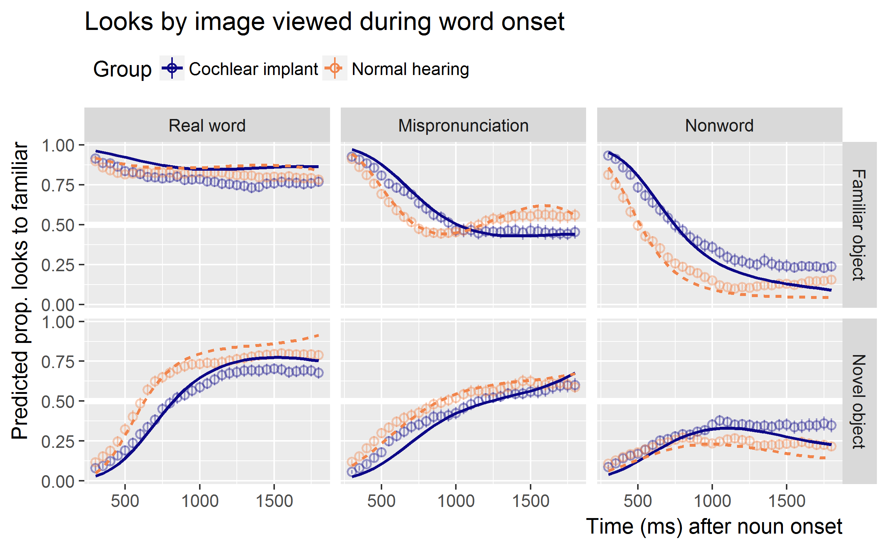
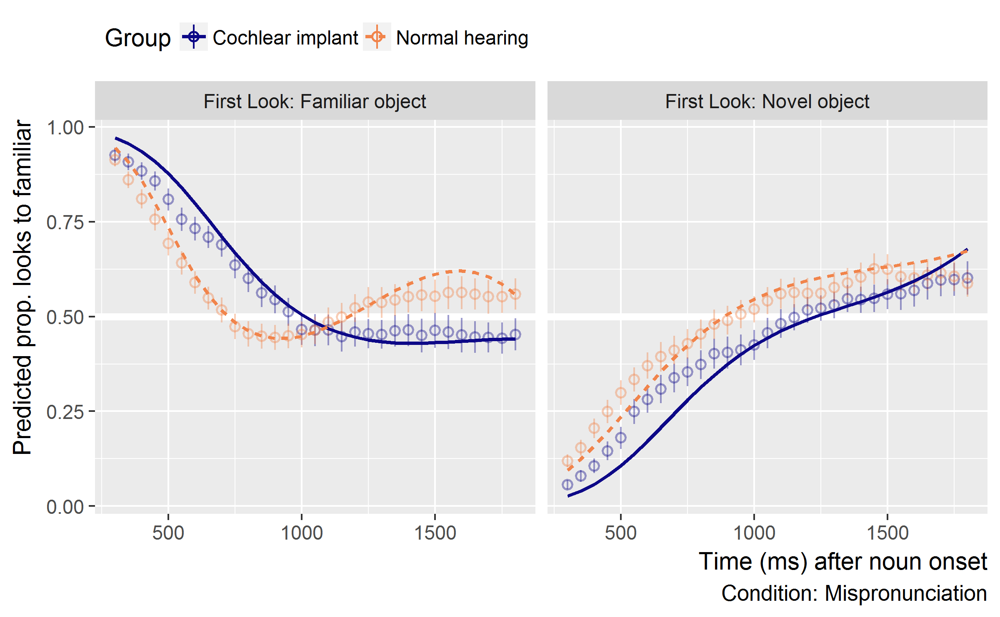
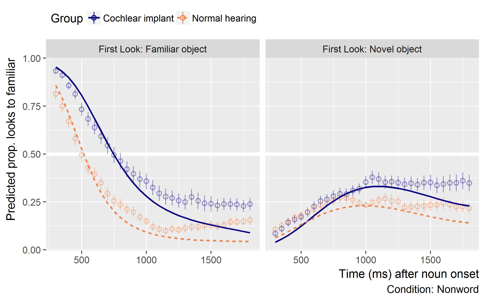
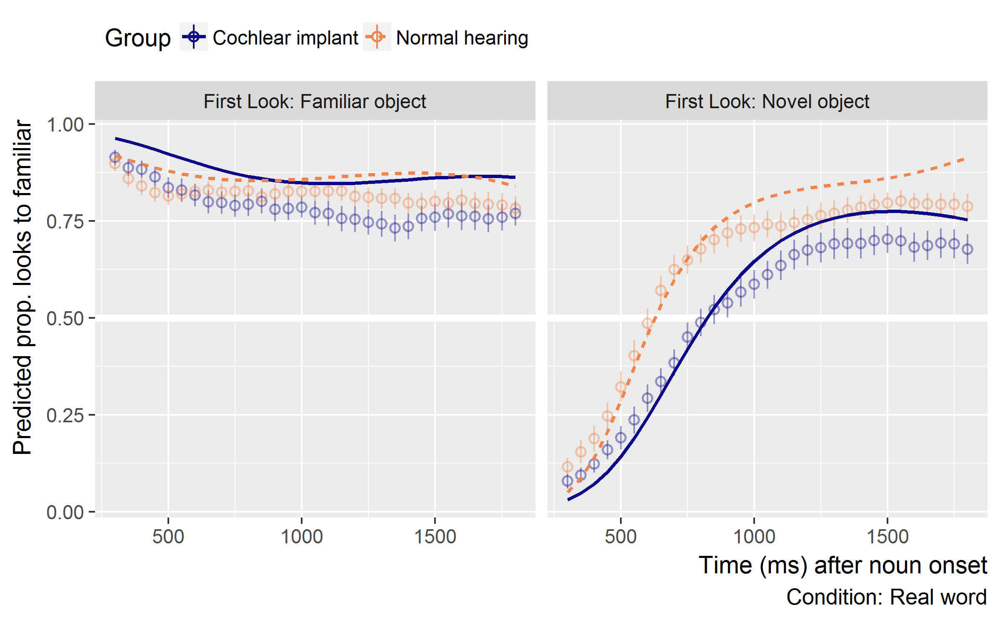

Consider the first image viewed
================
Tristan Mahr
2017-11-07

-   [Set up](#set-up)
    -   [Add orthogonal polynomials](#add-orthogonal-polynomials)
    -   [Prep the datasets](#prep-the-datasets)
-   [Group by initial image models](#group-by-initial-image-models)

This script fits an exploratory growth curve model where looks are re-aggregated based on where the child fixated at the onset of the noun.

Set up
------

``` r
library(dplyr)
library(littlelisteners)
library(ggplot2)
library(lme4)

source("./plotting-helpers.R", encoding = "UTF8")
looks <- readr::read_csv("./data/bias.csv.gz") %>% 
  mutate(
    Cond_Lab = Condition %>% 
      factor(c("real", "MP", "nonsense"),
             c("Real word", "Mispronunciation", "Nonword")))
```

### Add orthogonal polynomials

``` r
looks <- looks %>% 
  polypoly::poly_add_columns(Time, degree = 3, prefix = "ot") 
```

### Prep the datasets

For the models with vocabulary information, we need to remove any pairs of children in which one of the children is missing an EVT score. We identify those pairs.

``` r
no_vocab_pairs <- looks %>%
  distinct(ChildStudyID, Matching_PairNumber, EVT_Standard) %>%
  filter(is.na(EVT_Standard)) %>%
  select(Matching_PairNumber) %>%
  print()
#> # A tibble: 1 x 1
#>   Matching_PairNumber
#>                 <int>
#> 1                  15
```

Prepare a dataset for each condition.

``` r
d_mp <- looks %>% 
  filter(Condition == "MP")

d_rw <- looks %>% 
  filter(Condition == "real")

d_ns <- looks %>% 
  filter(Condition == "nonsense")

d_mp_evt <- d_mp %>% 
  anti_join(no_vocab_pairs, by = "Matching_PairNumber")

d_rw_evt <- d_rw %>% 
  anti_join(no_vocab_pairs, by = "Matching_PairNumber")

d_ns_evt <- d_ns %>% 
  anti_join(no_vocab_pairs, by = "Matching_PairNumber")
```

Group by initial image models
-----------------------------

For these models we include an indicator for whether the child fixated on the familiar or novel object during target noun onset. This predictor doubled the number of (growth curve shape) parameters in our model and cuts the number of observations in cell by more than half. (More than half because in some trials the fixated at neither the familiar or novel object, so those trials have to be excluded.) So take these with a grain of salt.

``` r
glmer_controls <- glmerControl(
  optimizer = "bobyqa",
  optCtrl = list(maxfun = 2e5))

m_mp <- glmer(
  cbind(Target, Distractor) ~ 
    Bias_ImageAOI * Group * (ot1 + ot2 + ot3) + 
    (ot1 + ot2 + ot3 | ChildStudyID:Bias_ImageAOI),
  family = binomial,
  control = glmer_controls,
  data = d_mp)
summary(m_mp)
#> Generalized linear mixed model fit by maximum likelihood (Laplace Approximation) ['glmerMod']
#>  Family: binomial  ( logit )
#> Formula: cbind(Target, Distractor) ~ Bias_ImageAOI * Group * (ot1 + ot2 +  
#>     ot3) + (ot1 + ot2 + ot3 | ChildStudyID:Bias_ImageAOI)
#>    Data: d_mp
#> Control: glmer_controls
#> 
#>      AIC      BIC   logLik deviance df.resid 
#>  19059.3  19226.5  -9503.7  19007.3     4562 
#> 
#> Scaled residuals: 
#>     Min      1Q  Median      3Q     Max 
#> -3.5677 -0.4522 -0.0005  0.4693  2.7452 
#> 
#> Random effects:
#>  Groups                     Name        Variance Std.Dev. Corr             
#>  ChildStudyID:Bias_ImageAOI (Intercept)  0.9977  0.9988                    
#>                             ot1         13.2598  3.6414    0.00            
#>                             ot2          3.5883  1.8943   -0.04 -0.18      
#>                             ot3          1.9768  1.4060    0.12 -0.30 -0.02
#> Number of obs: 4588, groups:  ChildStudyID:Bias_ImageAOI, 148
#> 
#> Fixed effects:
#>                                            Estimate Std. Error z value Pr(>|z|)    
#> (Intercept)                                 -0.6519     0.1663  -3.921 8.83e-05 ***
#> Bias_ImageAOITarget                          1.1932     0.2352   5.072 3.93e-07 ***
#> GroupNormalHearing                           0.5379     0.2342   2.297  0.02164 *  
#> ot1                                          5.9965     0.6235   9.617  < 2e-16 ***
#> ot2                                         -2.1213     0.3445  -6.158 7.36e-10 ***
#> ot3                                          0.9311     0.2593   3.590  0.00033 ***
#> Bias_ImageAOITarget:GroupNormalHearing      -0.6398     0.3312  -1.932  0.05338 .  
#> Bias_ImageAOITarget:ot1                    -11.2921     0.8821 -12.801  < 2e-16 ***
#> Bias_ImageAOITarget:ot2                      5.1212     0.4894  10.465  < 2e-16 ***
#> Bias_ImageAOITarget:ot3                     -1.6502     0.3694  -4.467 7.93e-06 ***
#> GroupNormalHearing:ot1                      -1.7977     0.8697  -2.067  0.03874 *  
#> GroupNormalHearing:ot2                       0.3363     0.4730   0.711  0.47703    
#> GroupNormalHearing:ot3                      -0.3650     0.3582  -1.019  0.30823    
#> Bias_ImageAOITarget:GroupNormalHearing:ot1   5.2206     1.2285   4.250 2.14e-05 ***
#> Bias_ImageAOITarget:GroupNormalHearing:ot2  -0.3295     0.6686  -0.493  0.62215    
#> Bias_ImageAOITarget:GroupNormalHearing:ot3  -0.8108     0.5071  -1.599  0.10984    
#> ---
#> Signif. codes:  0 '***' 0.001 '**' 0.01 '*' 0.05 '.' 0.1 ' ' 1

m_rw <- glmer(
  cbind(Target, Distractor) ~ 
    Bias_ImageAOI * Group * (ot1 + ot2 + ot3) + 
    (ot1 + ot2 + ot3 | ChildStudyID:Bias_ImageAOI),
  family = binomial,
  control = glmer_controls,
  data = d_rw)
summary(m_rw)
#> Generalized linear mixed model fit by maximum likelihood (Laplace Approximation) ['glmerMod']
#>  Family: binomial  ( logit )
#> Formula: cbind(Target, Distractor) ~ Bias_ImageAOI * Group * (ot1 + ot2 +  
#>     ot3) + (ot1 + ot2 + ot3 | ChildStudyID:Bias_ImageAOI)
#>    Data: d_rw
#> Control: glmer_controls
#> 
#>      AIC      BIC   logLik deviance df.resid 
#>  17404.3  17571.5  -8676.2  17352.3     4562 
#> 
#> Scaled residuals: 
#>     Min      1Q  Median      3Q     Max 
#> -4.1663 -0.3971  0.0545  0.4682  3.8063 
#> 
#> Random effects:
#>  Groups                     Name        Variance Std.Dev. Corr             
#>  ChildStudyID:Bias_ImageAOI (Intercept)  1.532   1.238                     
#>                             ot1         20.611   4.540     0.24            
#>                             ot2          5.892   2.427    -0.28 -0.23      
#>                             ot3          1.978   1.406    -0.12 -0.29  0.12
#> Number of obs: 4588, groups:  ChildStudyID:Bias_ImageAOI, 148
#> 
#> Fixed effects:
#>                                            Estimate Std. Error z value Pr(>|z|)    
#> (Intercept)                                 0.05722    0.20529   0.279  0.78046    
#> Bias_ImageAOITarget                         1.95087    0.29253   6.669 2.58e-11 ***
#> GroupNormalHearing                          0.77210    0.29039   2.659  0.00784 ** 
#> ot1                                         6.98521    0.76142   9.174  < 2e-16 ***
#> ot2                                        -3.34256    0.42395  -7.884 3.16e-15 ***
#> ot3                                         0.43291    0.26141   1.656  0.09771 .  
#> Bias_ImageAOITarget:GroupNormalHearing     -0.89267    0.41179  -2.168  0.03017 *  
#> Bias_ImageAOITarget:ot1                    -8.62163    1.09081  -7.904 2.70e-15 ***
#> Bias_ImageAOITarget:ot2                     4.84128    0.61460   7.877 3.35e-15 ***
#> Bias_ImageAOITarget:ot3                    -1.00760    0.38021  -2.650  0.00805 ** 
#> GroupNormalHearing:ot1                     -0.04553    1.07435  -0.042  0.96620    
#> GroupNormalHearing:ot2                      0.24798    0.59766   0.415  0.67821    
#> GroupNormalHearing:ot3                      0.99510    0.36728   2.709  0.00674 ** 
#> Bias_ImageAOITarget:GroupNormalHearing:ot1  1.22039    1.52460   0.800  0.42344    
#> Bias_ImageAOITarget:GroupNormalHearing:ot2 -1.36532    0.85210  -1.602  0.10909    
#> Bias_ImageAOITarget:GroupNormalHearing:ot3 -1.04179    0.52472  -1.985  0.04710 *  
#> ---
#> Signif. codes:  0 '***' 0.001 '**' 0.01 '*' 0.05 '.' 0.1 ' ' 1

m_ns <- glmer(
  cbind(Target, Distractor) ~ 
    Bias_ImageAOI * Group * (ot1 + ot2 + ot3) + 
    (ot1 + ot2 + ot3 | ChildStudyID:Bias_ImageAOI),
  family = binomial,
  control = glmer_controls,
  data = d_ns)
summary(m_ns)
#> Generalized linear mixed model fit by maximum likelihood (Laplace Approximation) ['glmerMod']
#>  Family: binomial  ( logit )
#> Formula: cbind(Target, Distractor) ~ Bias_ImageAOI * Group * (ot1 + ot2 +  
#>     ot3) + (ot1 + ot2 + ot3 | ChildStudyID:Bias_ImageAOI)
#>    Data: d_ns
#> Control: glmer_controls
#> 
#>      AIC      BIC   logLik deviance df.resid 
#>  17334.3  17501.5  -8641.1  17282.3     4562 
#> 
#> Scaled residuals: 
#>     Min      1Q  Median      3Q     Max 
#> -2.6597 -0.4962 -0.0832  0.4242  2.7724 
#> 
#> Random effects:
#>  Groups                     Name        Variance Std.Dev. Corr             
#>  ChildStudyID:Bias_ImageAOI (Intercept)  1.237   1.112                     
#>                             ot1         25.610   5.061     0.46            
#>                             ot2          5.526   2.351     0.07  0.18      
#>                             ot3          2.940   1.715    -0.11 -0.30 -0.15
#> Number of obs: 4588, groups:  ChildStudyID:Bias_ImageAOI, 148
#> 
#> Fixed effects:
#>                                            Estimate Std. Error z value Pr(>|z|)    
#> (Intercept)                                 -1.2367     0.1845  -6.703 2.05e-11 ***
#> Bias_ImageAOITarget                          0.6663     0.2628   2.535  0.01124 *  
#> GroupNormalHearing                          -0.3465     0.2606  -1.330  0.18359    
#> ot1                                          2.3045     0.8478   2.718  0.00656 ** 
#> ot2                                         -2.6237     0.4126  -6.359 2.04e-10 ***
#> ot3                                          0.7264     0.3058   2.376  0.01751 *  
#> Bias_ImageAOITarget:GroupNormalHearing      -0.8685     0.3717  -2.337  0.01946 *  
#> Bias_ImageAOITarget:ot1                    -10.3590     1.2095  -8.564  < 2e-16 ***
#> Bias_ImageAOITarget:ot2                      5.1825     0.5957   8.700  < 2e-16 ***
#> Bias_ImageAOITarget:ot3                     -1.3786     0.4438  -3.107  0.00189 ** 
#> GroupNormalHearing:ot1                      -1.5960     1.1937  -1.337  0.18119    
#> GroupNormalHearing:ot2                       0.7802     0.5757   1.355  0.17538    
#> GroupNormalHearing:ot3                      -0.1495     0.4274  -0.350  0.72656    
#> Bias_ImageAOITarget:GroupNormalHearing:ot1   2.3202     1.7069   1.359  0.17406    
#> Bias_ImageAOITarget:GroupNormalHearing:ot2  -0.2300     0.8341  -0.276  0.78272    
#> Bias_ImageAOITarget:GroupNormalHearing:ot3   0.1806     0.6206   0.291  0.77110    
#> ---
#> Signif. codes:  0 '***' 0.001 '**' 0.01 '*' 0.05 '.' 0.1 ' ' 1
```

We can plot the growth curve fixed effects which describe how the average child in each group x condition x initial-look performs.



------------------------------------------------------------------------

``` r
sessioninfo::session_info()
#> - Session info -----------------------------------------------------------------------------------
#>  setting  value                       
#>  version  R version 3.4.1 (2017-06-30)
#>  os       Windows 7 x64 SP 1          
#>  system   x86_64, mingw32             
#>  ui       RTerm                       
#>  language (EN)                        
#>  collate  English_United States.1252  
#>  tz       America/Chicago             
#>  date     2017-11-07                  
#> 
#> - Packages ---------------------------------------------------------------------------------------
#>  package         * version    date       source                                 
#>  assertthat        0.2.0      2017-04-11 CRAN (R 3.3.2)                         
#>  backports         1.1.1      2017-09-25 CRAN (R 3.4.1)                         
#>  bindr             0.1        2016-11-13 CRAN (R 3.4.0)                         
#>  bindrcpp        * 0.2        2017-06-17 CRAN (R 3.4.0)                         
#>  clisymbols        1.2.0      2017-08-04 Github (gaborcsardi/clisymbols@e49b4f5)
#>  colorspace        1.3-2      2016-12-14 CRAN (R 3.3.2)                         
#>  digest            0.6.12     2017-01-27 CRAN (R 3.3.2)                         
#>  dplyr           * 0.7.4      2017-09-28 CRAN (R 3.4.2)                         
#>  evaluate          0.10.1     2017-06-24 CRAN (R 3.4.1)                         
#>  ggplot2         * 2.2.1      2016-12-30 CRAN (R 3.4.1)                         
#>  glue              1.2.0      2017-10-29 CRAN (R 3.4.2)                         
#>  gridExtra         2.3        2017-09-09 CRAN (R 3.4.1)                         
#>  gtable            0.2.0      2016-02-26 CRAN (R 3.2.3)                         
#>  hms               0.3        2016-11-22 CRAN (R 3.3.2)                         
#>  htmltools         0.3.6      2017-04-28 CRAN (R 3.4.0)                         
#>  knitr           * 1.17       2017-08-10 CRAN (R 3.4.2)                         
#>  labeling          0.3        2014-08-23 CRAN (R 3.1.1)                         
#>  lattice           0.20-35    2017-03-25 CRAN (R 3.3.3)                         
#>  lazyeval          0.2.1      2017-10-29 CRAN (R 3.4.2)                         
#>  littlelisteners * 0.0.0.9000 2017-09-22 Github (tjmahr/littlelisteners@44e87a4)
#>  lme4            * 1.1-14     2017-09-27 CRAN (R 3.4.2)                         
#>  magrittr          1.5        2014-11-22 CRAN (R 3.1.2)                         
#>  MASS              7.3-47     2017-02-26 CRAN (R 3.4.1)                         
#>  Matrix          * 1.2-11     2017-08-16 CRAN (R 3.4.2)                         
#>  minqa             1.2.4      2014-10-09 CRAN (R 3.1.1)                         
#>  munsell           0.4.3      2016-02-13 CRAN (R 3.2.3)                         
#>  nlme              3.1-131    2017-02-06 CRAN (R 3.4.1)                         
#>  nloptr            1.0.4      2014-08-04 CRAN (R 3.1.1)                         
#>  pkgconfig         2.0.1      2017-03-21 CRAN (R 3.3.3)                         
#>  plyr              1.8.4      2016-06-08 CRAN (R 3.3.0)                         
#>  polypoly          0.0.2      2017-05-30 Github (tjmahr/polypoly@4370bb5)       
#>  R6                2.2.2      2017-06-17 CRAN (R 3.4.0)                         
#>  Rcpp              0.12.13    2017-09-28 CRAN (R 3.4.2)                         
#>  readr             1.1.1      2017-05-16 CRAN (R 3.4.0)                         
#>  reshape2          1.4.2      2016-10-22 CRAN (R 3.3.1)                         
#>  rlang           * 0.1.4      2017-11-05 CRAN (R 3.4.2)                         
#>  rmarkdown         1.6        2017-06-15 CRAN (R 3.4.2)                         
#>  rprojroot         1.2        2017-01-16 CRAN (R 3.3.2)                         
#>  scales            0.5.0      2017-08-24 CRAN (R 3.4.1)                         
#>  sessioninfo       1.0.1      2017-09-13 Github (r-lib/sessioninfo@e813de4)     
#>  stringi           1.1.5      2017-04-07 CRAN (R 3.3.3)                         
#>  stringr           1.2.0      2017-02-18 CRAN (R 3.3.2)                         
#>  tibble            1.3.4      2017-08-22 CRAN (R 3.4.1)                         
#>  viridis           0.4.0      2017-03-27 CRAN (R 3.3.3)                         
#>  viridisLite       0.2.0      2017-03-24 CRAN (R 3.3.2)                         
#>  withr             2.1.0.9000 2017-11-02 Github (jimhester/withr@8ba5e46)       
#>  yaml              2.1.14     2016-11-12 CRAN (R 3.4.2)
```
